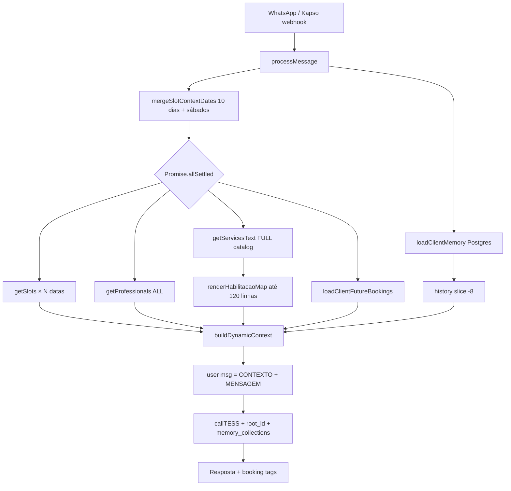
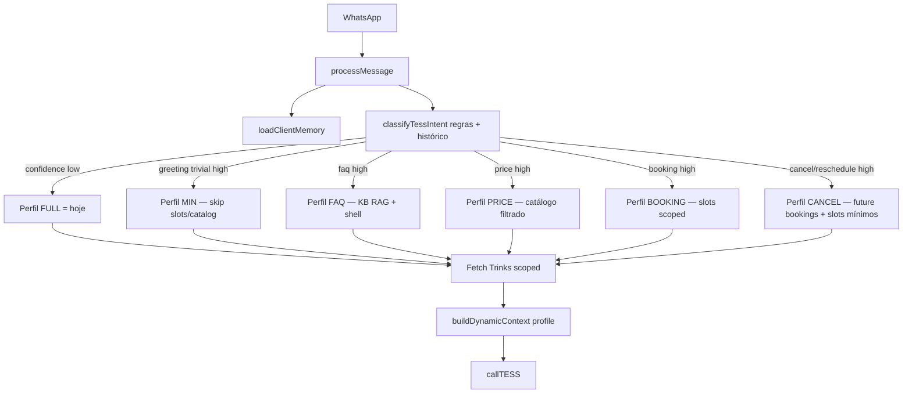

# TESS Context-on-Demand — Studio Tirra (Agente 46589)

**Autor:** Aria (@architect) · **Data:** 2026-09-01  
**Status:** PROPOSTA — **não comprovada até eval QA passar**  
**Agente:** 46589 · Claude 4.5 Haiku · sem thinking · sem tools  
**Base:** `backend/server.js` (`buildDynamicContext`, `processMessage`, `callTESS`), `docs/analysis/plano-otimizacao-memoria-tess.md` Passo 2

---

## 1. Objetivo e restrições

### 1.1 Objetivo

Reduzir **tokens de entrada** injetados ao TESS a cada turno, mantendo a qualidade percebida (tom Studio Tirra, precisão de SKU/preço/slot, continuidade conversacional), para que o bot caiba na assinatura **TESS PRO (~4.000 cr + ~600 bônus/dia → ~4.600 cr/mês)** com volume medido de **~22,7 conversas/dia** (159 conversas iniciadas / 7 dias, recepção).

### 1.2 Restrições duras

| # | Restrição |
|---|-----------|
| R1 | Modelo permanece **Claude 4.5 Haiku** — sem Grok ou troca de modelo |
| R2 | **Qualidade > custo** — se intent incerto, montar contexto **completo** (fallback conservador) |
| R3 | Não inventar requisitos — escopo derivado do código existente |
| R4 | Implementação **antes de `BOT_ACCEPT_ALL=true`** — rollout via whitelist + feature flag |
| R5 | Design **não é provado** até `@qa` executar eval (62 cenários + matriz salão) **sem regressão** |

### 1.3 Premissas de volume (explicitar incerteza)

| Parâmetro | Valor | Fonte |
|---|---|---|
| Conversas/dia | **22,7** | 159 / 7 dias (recepção) |
| Conversas/mês | **~681** | 22,7 × 30 |
| Respostas bot/conversa | **~3** (premissa até medir) | instrução de escopo |
| Mensagens bot/mês | **~2.043** | 681 × 3 |
| Crédito alvo/mês | **4.000–4.600** | TESS PRO + bônus |
| Crédito alvo/msg (média) | **~2,0–2,3 cr** | 4.600 / 2.043 |
| Baseline medido | **~29,2 cr/msg** | TESS `/workspaces/usage` 15/ago–01/set |
| Input tokens (período) | **~50.829 input** | mesma API — driver secundário após thinking off |

> **Alerta de viabilidade:** com ~29 cr/msg e ~2.043 msgs/mês, o consumo projetado é **~59.600 cr/mês** (13× o teto). Mesmo o patamar pós-thinking-off (~13 cr/msg, doc de custo) ainda estoura. A otimização de contexto é **necessária**; atingir **2,3 cr/msg médio** exige combinar skip agressivo em turnos triviais + perfis enxutos + mix real de intents favorável. Se após QA a média ficar ~5–6 cr/msg, o tier TESS precisa subir — este doc não promete caber no PRO sem medição pós-deploy.

---

## 2. Arquitetura atual (baseline)

### 2.1 Fluxo numerado

1. **Webhook Kapso** → `processMessage(sessionId, messageText, …)` (`server.js:1063`)
2. **Cold start:** `loadClientMemory(phone)` — até 15 turnos Postgres + row `clients` (`server.js:255-274`)
3. **Datas de slot:** `mergeSlotContextDates(getNextBusinessDays(SLOT_CONTEXT_DAYS), nextSaturdayDates(5, 35))` — default **10 dias úteis + até 5 sábados** (`server.js:217`, `1100-1103`)
4. **Data explícita na mensagem:** `extractRequestedDate(messageText)` → `ensureSlotSnapshot` se fora da janela (`server.js:1104-1112`, `salon-dates.js:198`)
5. **Fetch paralelo (sempre):**
   - `getSlots(date)` para **cada** data da janela (`server.js:1114-1115`)
   - `getProfessionals()` — lista completa (`server.js:1116`)
   - `getServicesText()` — **catálogo inteiro** 50+ SKUs (`server.js:1117`, `561-595`)
   - `loadClientFutureBookings(phone)` (`server.js:1118`)
6. **Montagem:** `renderHabilitacaoMap(svcPayload.data)` — até **120 linhas** prof↔serviço (`booking-parser.js:213`, `255-271`)
7. **Histórico:** `state.history.slice(-8)` + persisted history slice -8 (`server.js:1140-1145`)
8. **`buildDynamicContext(...)`** — concatena tudo (`server.js:369-401`)
9. **Payload TESS:** user message = `dynamicContext + "\n\nMENSAGEM DO CLIENTE: " + messageText` (`server.js:1160-1162`)
10. **`callTESS(messages, state.rootId)`** — thread TESS + opcional `memory_collections` RAG KB (`server.js:982-1005`)
11. Pós-resposta: tags booking, guards, persistência

### 2.2 Diagrama (montagem de contexto hoje)



### 2.3 Onde vão os tokens (estimativa por componente)

Ordem de magnitude com snapshot local populado (~12 profissionais, ~50 serviços, 10+ dias de slots):

| Bloco | Origem código | Tokens est. | % do dinâmico |
|---|---|---:|---:|
| Shell fixo (HOJE, horário, NOTAS OPERACIONAIS) | `buildDynamicContext` L384-390 | ~400–550 | ~5% |
| HORARIOS VAGOS × N dias | `getSlots` × `SLOT_CONTEXT_DAYS` | ~4.000–8.000 | **~45–55%** |
| SERVICOS DISPONIVEIS (catálogo completo) | `getServicesText` | ~2.500–3.500 | **~25–30%** |
| HABILITACAO prof↔serviço | `renderHabilitacaoMap` | ~1.500–2.500 | ~15–20% |
| PROFISSIONAIS ATIVOS | `getProfessionals` | ~150–250 | ~2% |
| DADOS_CLIENTE + histórico | `buildPersistedSection` + slice -8 | ~500–2.000 | ~5–10% |
| AGENDAMENTOS FUTUROS | `renderFutureBookings` | ~0–300 | ~0–3% |
| Prompt TESS (dashboard) | fixo no agente | **~3.500** | fora do backend |
| RAG `memory_collections` | `callTESS` KB | variável | não instrumentado |

**Conclusão:** ~85–90% do contexto dinâmico é **slots + catálogo + habilitação**, reinjetados **em todo turno**, inclusive `"oi"` ou `"qual o endereço?"`.

---

## 3. Arquitetura alvo — contexto por intent + skip-list

### 3.1 Princípios

1. **Classificar intent antes de buscar Trinks** — regras determinísticas + sinais de histórico (sem LLM extra).
2. **Perfil de contexto por intent** — cada perfil declara quais blocos incluir e com qual escopo.
3. **Fallback conservador** — `confidence !== 'high'` → perfil `FULL` (comportamento atual).
4. **Skip-list** só para turnos **unambiguous trivial** — nunca skip se histórico recente menciona serviço/data/profissional.
5. **Fetch lazy** — `getSlots` só para datas necessárias; catálogo filtrado por keywords/sinônimos já existentes na KB.
6. **Fase 2 (opcional, pós-QA):** experimento `root_id` stateless — **não** no MVP.

### 3.2 Diagrama alvo



### 3.3 Novos módulos (proposta)

| Módulo | Responsabilidade |
|---|---|
| `backend/lib/tess-context-intent.js` | `classifyTessIntent(messageText, history, futureBookings)` → `{ intent, confidence, signals }` |
| `backend/lib/tess-context-profiles.js` | `buildContextProfile(intent, signals)` → spec de fetch + filtros |
| `backend/lib/tess-context-assembler.js` | Orquestra fetch lazy + chama `buildDynamicContext` parametrizado |

`buildDynamicContext` ganha parâmetro opcional `profile` (ou funções irmãs) — **sem duplicar** lógica de formatação existente.

### 3.4 Feature flag

```bash
TESS_CONTEXT_MODE=full          # default — zero risco, comportamento atual
TESS_CONTEXT_MODE=scoped        # intent-on-demand ativo
TESS_CONTEXT_FORCE_FULL=1       # kill switch emergencial
```

Rollout: whitelist existente → comparar cr/msg e qualidade → só então considerar `BOT_ACCEPT_ALL`.

---

## 4. Política conservadora de intent

### 4.1 Regra de ouro

> **Na dúvida → `FULL`.** Qualquer sinal de serviço, data, profissional, preço, cancelamento, imagem, áudio, ou continuação de fluxo de agendamento **desliga skip** e inclui catálogo/slots adequados.

### 4.2 Sinais que elevam para FULL (nunca skip)

| Sinal | Detecção |
|---|---|
| Serviço mencionado | keywords + sinônimos (`data/kb/conversa-v2/sinonimos-servicos.md`), nomes de profissionais do snapshot |
| Data/hora | `extractRequestedDate`, regex horário (`\d{1,2}[h:]\d{0,2}`, `amanhã`, `hoje`, `tarde`, dias da semana) |
| Profissional | lista de apelidos Trinks (Tiago, Andre, Fefe, Gi, …) |
| Preço / quanto custa | `quanto`, `preço`, `valor`, `custa` |
| Cancel / remarcar | `cancel`, `desmarc`, `remarc`, `mudar horário` |
| Confirmação de booking | histórico contém tag ou assistant perguntou horário/serviço |
| `futureBookings.length > 0` + verbo de ação | cancel/reschedule implícito |
| Imagem / áudio | `[CLIENTE ENVIOU IMAGEM]`, media Kapso |
| Mensagem > 40 chars com substantivo de serviço | heurística anti falso greeting |
| Intent ambíguo | `confidence !== 'high'` |
| Primeiro turno com nome de serviço | ex.: `"quero cortar"` — **BOOKING**, não greeting |

### 4.3 Skip-safe (perfil MIN permitido, `confidence: high`)

Apenas se **nenhum** sinal acima + histórico vazio ou só greeting anterior:

| Utterance (normalizada) | Perfil |
|---|---|
| `oi`, `olá`, `ola`, `oie`, `e aí`, `eai` | MIN |
| `bom dia`, `boa tarde`, `boa noite` | MIN |
| `tudo bem?`, `td bem` | MIN |
| `hey`, `hi` | MIN |

Resposta esperada: acolhimento Studio Tirra **sem** inventar slots/preços — pergunta aberta ("como posso te ajudar?").

### 4.4 Never-skip (sempre contexto ampliado)

| Utterance / padrão | Perfil mínimo |
|---|---|
| Qualquer menção a serviço (corte, mechas, camuflagem, escova, …) | PRICE ou BOOKING |
| Qualquer data/hora/período | BOOKING |
| Qualquer profissional | BOOKING |
| `quanto`, `preço`, `valor` | PRICE |
| `endereço`, `onde fica`, `estacionamento`, `pix`, `formas de pagamento` | FAQ (KB RAG; catálogo opcional) |
| `cancel`, `desmarc`, `remarc` | CANCEL |
| `falar com`, `humano`, `Gabriel`, `atendente` | FAQ + handoff (sem skip de histórico) |
| Continuação: `sim`, `pode`, `confirmo`, `esse horário` | FULL ou BOOKING (usa histórico) |
| Reclamação / insatisfação | FULL |
| Owner (`isOwnerPhone`) | FULL |

### 4.5 Matriz intent → blocos de contexto

| Bloco | MIN | FAQ | PRICE | BOOKING | CANCEL | FULL |
|---|:---:|:---:|:---:|:---:|:---:|:---:|
| Shell (HOJE, horário, NOTAS) | ✓ | ✓ | ✓ | ✓ | ✓ | ✓ |
| DADOS_CLIENTE + histórico -8 | ✓ | ✓ | ✓ | ✓ | ✓ | ✓ |
| PROFISSIONAIS (lista) | — | — | — | ✓* | — | ✓ |
| SERVICOS (filtrado) | — | — | ✓ | ✓* | — | ✓ |
| HABILITACAO (filtrada) | — | — | ✓ | ✓ | — | ✓ |
| HORARIOS VAGOS | — | — | — | ✓** | ✓** | ✓ |
| AGENDAMENTOS FUTUROS | — | — | — | — | ✓ | ✓ |
| DATA SOLICITADA | — | — | — | ✓ | ✓ | ✓ |

\* Se profissional ou serviço já conhecido nos sinais, filtrar; senão incluir lista completa de profs (barato) + habilitação filtrada.  
\*\* Escopo de datas — ver §5.

---

## 5. Orçamento de tokens e créditos por classe de intent

### 5.1 Fórmula de crédito (Haiku via TESS)

```
cr = (input_tokens / 100) × 0,048 + (output_tokens / 100) × 0,24
```

Saída típica WhatsApp: **~80–150 tokens** (~0,2–0,4 cr só de output).

> **Calibração:** medição live ~29 cr/msg com contexto cheio sugere markup TESS além da fórmula raw (~4–5×). Tabela abaixo usa **tokens estimados** + **cr raw** + **cr calibrada** (×4,5 sobre raw, arredondado).

### 5.2 Orçamento por intent

| Intent | Input tokens alvo | Output est. | cr raw | cr calibrada (~×4,5) | Notas |
|---|---:|---:|---:|---:|---|
| **MIN** (greeting) | 1.200–1.800 | ~100 | 0,8–1,1 | **~3,5–5,0** | Sem slots/catálogo/habilitação |
| **FAQ** | 2.000–3.500 | ~120 | 1,2–1,9 | **~5,5–8,5** | Shell + histórico; KB via RAG |
| **PRICE** | 3.000–5.000 | ~130 | 1,8–2,7 | **~8–12** | Catálogo filtrado (3–8 SKUs) + habilitação filtrada |
| **BOOKING** | 5.000–8.000 | ~150 | 2,8–4,2 | **~13–19** | Slots 1–3 dias + catálogo filtrado |
| **CANCEL** | 2.500–4.500 | ~120 | 1,5–2,4 | **~7–11** | Future bookings + slots 1–2 dias se remarcar |
| **FULL** (fallback) | 10.000–15.000 | ~150 | 5,2–7,5 | **~23–34** | Comportamento atual |

### 5.3 Escopo de slots por intent BOOKING

| Cenário | Dias de slot | Lógica |
|---|---|---|
| Data explícita na mensagem | **1 dia** (+ vizinho se pedir "tarde/noite") | `extractRequestedDate` |
| "amanhã" / "hoje" | **1–2 dias** | parser relativo |
| "quinta", dia da semana | **1 dia** resolvido | `salon-dates.js` |
| Sem data, início de agendamento | **3 dias** (não 10) | `[AUTO-DECISION]` reduzir de 10→3 no BOOKING inicial |
| Profissional + serviço definidos | **1–2 dias** | slots filtrados por prof |
| Fallback conservador | **10 dias + sábados** | intent incerto → FULL |

`SLOT_CONTEXT_DAYS` permanece env var; perfil BOOKING usa `Math.min(SLOT_CONTEXT_DAYS, 3)` salvo FULL.

### 5.4 Projeção de mix (ilustrativa — medir em prod)

Premissa até telemetria: 20% MIN, 25% FAQ, 15% PRICE, 30% BOOKING, 5% CANCEL, 5% FULL.

```
Média ilustrativa = 0,20×4 + 0,25×7 + 0,15×10 + 0,30×16 + 0,05×9 + 0,05×28
                  ≈ 0,8 + 1,75 + 1,5 + 4,8 + 0,45 + 1,4 ≈ 10,7 cr/msg
2.043 × 10,7 ≈ 21.860 cr/mês
```

Ainda acima de 4.600 — **precisa** aumentar taxa de MIN/FAQ (turnos triviais) e/ou reduzir BOOKING para ~8–10 cr via slots 1–2 dias. Meta agressiva (~6 cr/msg médio) exige ~65% dos turnos abaixo de 5 cr.

---

## 6. Riscos de regressão de qualidade e mitigações

| Risco | Como acontece | Mitigação |
|---|---|---|
| **Slot errado / dia errado** | Perfil BOOKING com poucos dias; cliente diz "semana que vem" | FULL se data ambígua; `extractRequestedDate` falhou → incluir 3 dias + pedir data objetiva (prompt já orienta) |
| **SKU / preço errado** | Catálogo filtrado omitiu sinônimo (ex.: camuflagem → coloração) | Fallback FULL se keyword casou sinônimo ambíguo; manter `OPERATIONAL_NOTES` sempre; PRICE inclui linhas de sinônimos matched |
| **Profissional incompatível** | Habilitação filtrada incompleta | Se serviço restrito (Fefe/Gi) detectado, incluir **sempre** habilitação daquele serviço; guard `applyOperationalHabilitacao` inalterado |
| **Esquecer escolha anterior** | Skip em turno "sim" / "pode" | Never-skip: confirmações olham histórico -8; perfil BOOKING mínimo |
| **Cancelar booking errado** | CANCEL sem `futureBookings` | Se `futureBookings.length === 0`, tratar como FAQ/BOOKING — nunca CANCEL |
| **Áudio/imagem quebrado** | Skip indevido | Detectar media → FULL |
| **RAG KB duplica FAQ** | FAQ perfil + memory_collections | Aceitável (KB é leve); monitorar tokens TESS usage |
| **Falso greeting** | "oi quero cortar amanhã" classificado MIN | Regex composta: greeting + serviço → BOOKING |
| **Regressão de marca** | Respostas secas no MIN | MIN ainda inclui histórico; prompt TESS intacto; eval qualitativo @qa |

---

## 7. Ordem de implementação (antes de `BOT_ACCEPT_ALL`)

| Fase | Entrega | Risco | Gate |
|:---:|---|---|---|
| **0** | Telemetria: log `{ intent, confidence, input_chars, profile }` por chamada | Nulo | Comparar com `/workspaces/usage` |
| **1** | `classifyTessIntent` + testes unitários (tabelas §4.3–4.4) | Baixo | CI verde |
| **2** | `TESS_CONTEXT_MODE=scoped` com **fallback FULL** se confidence ≠ high | Baixo | Whitelist A/B |
| **3** | Perfil **MIN** (skip-list) | Médio | QA cenários greeting + falso positivo |
| **4** | Perfil **PRICE** — catálogo filtrado por keyword/sinônimo | Médio | QA preço/camuflagem/meias |
| **5** | Perfil **BOOKING** — slots lazy (1–3 dias) | **Alto** | QA matriz agendamento 1–20 |
| **6** | Perfil **CANCEL** + future bookings | Médio | QA cancel/remarcar 4, 21–24 |
| **7** | Perfil **FAQ** explícito (sem catálogo) | Baixo | QA endereço/pagamento 22–25 |
| **8** | Eval completo 62 cenários + matriz salão | — | **BLOQUEANTE** |
| **9** | (Opcional pós-QA) Experimento `root_id` null em 10% whitelist | Alto | Comparar cr + qualidade |

**Não incluir no MVP:** resumo rolante LLM, mudança de modelo, desligar `memory_collections`.

---

## 8. Arquivos a tocar

| Arquivo | Mudança |
|---|---|
| `backend/server.js` | Orquestração: classificar intent antes do `Promise.all`; passar profile a `buildDynamicContext`; telemetria |
| `backend/lib/tess-context-intent.js` | **Novo** — classificador determinístico |
| `backend/lib/tess-context-profiles.js` | **Novo** — specs de fetch/filtro |
| `backend/lib/tess-context-assembler.js` | **Novo** — fetch lazy de slots/catálogo |
| `backend/lib/booking-parser.js` | Exportar helpers: `filterServicesByKeywords`, `filterHabilitacaoForServices` (reutilizar `servicesForProfessional`, sinônimos) |
| `backend/lib/salon-dates.js` | Opcional: helper `resolveRelativeDate` para "amanhã/hoje" |
| `backend/test/tess-context-intent.test.js` | **Novo** |
| `backend/test/tess-context-profiles.test.js` | **Novo** |
| `.env.example` | Documentar `TESS_CONTEXT_MODE`, `TESS_CONTEXT_FORCE_FULL` |

**Fora de escopo:** prompt TESS dashboard, Kapso, migrations, frontend admin.

---

## 9. Critérios de aceite (@qa — gate bloqueante)

1. **Zero regressão** nos 62 cenários de `tests/prompt-tests.json` / `run-prompt-tests.js` com `TESS_CONTEXT_MODE=scoped`.
2. Matriz manual P0 (`docs/qa/salon-test-matrix.md` IDs 1, 4, 13, 20–24, 41–43) **PASS**.
3. Crédito/msg na whitelist **≤ baseline** (29,2 cr) com redução **≥ 40%** na média por 7 dias — ou justificativa documentada se meta 4.600/mês exigir tier superior.
4. Nenhum caso de SKU inventado, slot inexistente ofertado, ou profissional errado para maquiagem/penteado.
5. Rollback: `TESS_CONTEXT_MODE=full` ou `TESS_CONTEXT_FORCE_FULL=1` restaura comportamento atual **sem redeploy**.

> ⚠️ **Este design NÃO está comprovado até o eval QA acima passar.** A arquitetura é sound; o trade-off custo×qualidade só fecha com dados reais pós-implementação.

---

## 10. Decisões automáticas registradas

| ID | Pergunta | Decisão | Motivo |
|---|---|---|---|
| AD-1 | Quantos dias no BOOKING inicial sem data? | **3 dias** | Equilíbrio: menor que 10, suficiente para "tem horário essa semana?" |
| AD-2 | Classificador LLM extra? | **Não** | Evita latência, custo e non-determinismo; regras + histórico bastam na whitelist |
| AD-3 | Remover `root_id` no MVP? | **Não** | Passo 1 provou impacto baixo; risco de perda de thread > ganho |
| AD-4 | Desligar `memory_collections`? | **Não** | FAQ depende de KB; custo RAG menor que catálogo Trinks |
| AD-5 | Postgres vs Sheets/HubSpot | **Manter Postgres** | Já é source of truth; alinhado ao Passo 2 |

---

## Referências

- `backend/server.js:369-401` — `buildDynamicContext`
- `backend/server.js:1063-1163` — `processMessage` + chamada TESS
- `backend/server.js:982-1005` — `callTESS` (`root_id`, `memory_collections`)
- `docs/analysis/plano-otimizacao-memoria-tess.md` — Passo 2
- `docs/analysis/custo-mensal-studio-tirra-2026-06.md` — §4.2–4.4 drivers de crédito
