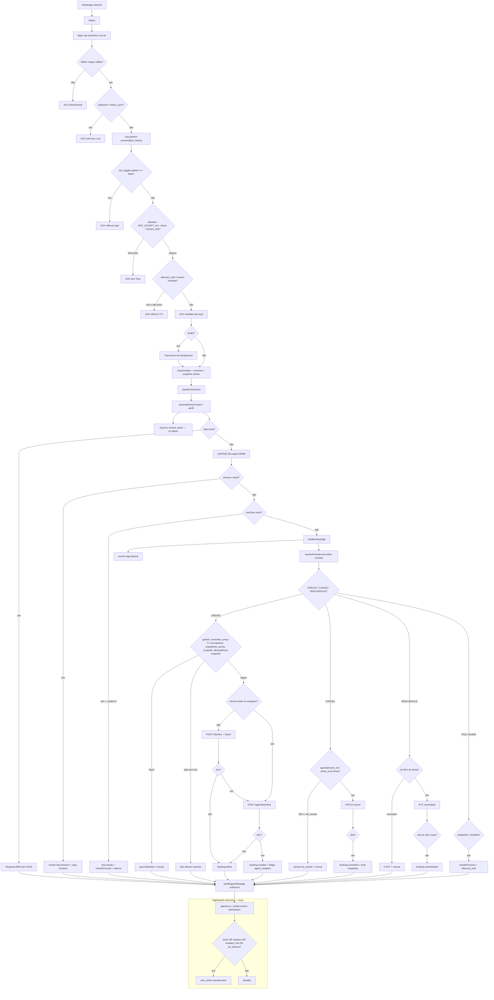

# Dossiê técnico/operacional — auditoria Tess 46589

**Para:** `@aiox-master` (Orion) + squads de auditoria (vertical técnica e fluxo/operação de negócio)  
**De:** Aria (@architect)  
**Quando:** 2026-09-03  
**Propósito:** dar à próxima sessão um mapa autocontido para procurar **padrões de falha** e propor **controles preventivos/preditivos**. Este arquivo substitui a leitura da conversa.

**Não é autorização de novo deploy.** Story 13 já está live. Não é PRD. Não fecha DoD do epic (deploy não é DoD). Recomendações da §8 são **PROPOSTA**.

---

## 1. Cabeçalho de estado

| Campo | Valor conhecido nesta sessão |
|---|---|
| Branch | `feature/tess-commit-honesty` alinhada com `origin/feature/tess-commit-honesty` |
| Código Story 13 no VPS | `07f59cb` — `fix: harden Nightwatch verification scope [Story 13]` |
| Docs pós-deploy no remote | `80cb950` — baseline final da patrulha (registro inicial `ca1b4af`, auditoria `b796b44`) |
| Publicado anterior | `0b39035` — Story 12 (CANCEL lean + timeout) + smoke `0007`/`8440` |
| Locais **ainda não publicados** | **311** entradas fora da fatia 13 (resume-ia, AIOX/skills, admin, ops, KB, infra). **Particionar.** Não tratar o tree como release |
| Pronto para deploy do resto? | **Não.** Só a fatia 13 subiu. Demais workstreams continuam locais |

### Publicado versus local

```text
VPS / origin ── 07f59cb ── Story 13 LIVE (Nightwatch p0_timeout + verify/orphans scoped)
docs remote ── 80cb950 ── baseline final da patrulha (branch alinhada)
anterior ───── 0b39035 ── Story 12 no ar + smoke 0007/8440 (honesty 1–12)
working tree ─ 311 entradas fora da 13 (resume-ia, AIOX, admin, ops, KB, infra)
```

- **No ar (1–13):** TipoId, sanitize C3, reschedule SKU, empty-handoff, createKeys, cancel-SKU, abort+booking, cancel-intent, CANCEL lean + timeout, Nightwatch `p0_timeout` / verify client-scoped / metadata whitelist.
- **Só no working tree:** outras ondas. **Não empacotar** com a 13 (já publicada).
- **Validação desta publicação:** health + `patrol_live` read-only (~19:11:20Z). **Sem** smoke WhatsApp mutável da Story 13, **sem** POST/PATCH/PUT Trinks nesta execução.

[AUTO-DECISION] gotchas.json ausente → skip; SOT = fatos de publicação confirmados + handoff Orion + epic + gate 13.

---

## 2. Executive summary

A Tess 46589 já **fala o que a Trinks gravou** nos smokes restritos de hoje (CREATE/CANCEL/cliente novo, Story 12). A Story 13 (Nightwatch) está **publicada e live** em `07f59cb`. Patrulha read-only ~19:11:20Z: `p0_timeout=0`, `p0_orphans=0`, `p0_leaks=0`, `p0_mutation_fail=0`; `next_action=activate-peer` veio **só** de `p0_stuck=20` (baseline histórico, não regressão evidenciada da 13). **Smoke WhatsApp mutável da 13 não ocorreu.** Residuais: UNCERTAIN/FULL grande, `tess.context_bytes` só log, outbox/trace/`catch` genérico, **311** alterações locais, e o lookback fixo de stuck (§2.1 / **P-STUCK**).

### Gates — testes locais versus validação live

| Camada | Resultado | Onde / o que prova |
|---|---|---|
| Testes focados Nightwatch + Trinks | **39/39 PASS** (local) | `backend/test/nightwatch-ops.test.js`, `backend/test/trinks-api.test.js` |
| Suíte backend | **531/531 PASS** (local) | `npm test --prefix backend` |
| Prompts / raiz | **79/79 PASS** (local) | `npm test` |
| lint / typecheck / syntax / diff | **PASS** (local) | `npm run lint`, `npm run typecheck`, `node --check`, diff de escopo negativo |
| CodeRabbit CLI | **0 findings** (local) | revisão final do backend da Story 13 |
| Gate formal | **PASS** | `docs/qa/gates/tess-commit.13-nightwatch-monitoring-scope.yml` — `deployed_revision: 07f59cb` |
| Health live | HTTP **200** interno e público | `status=ok`, `trinks_ping=ok`, TESS **46589** |
| Nightwatch live | `patrol_live` read-only ~19:11:20Z | `p0_timeout=0`; `p0_stuck=20` → `activate-peer`; ver §2.1 |
| Smoke WhatsApp da 13 | **não executado** | não alegar I1/I2 live desta publicação |

Story 12 (já no ar antes): 103/103 focados, 512/512 backend, 79/79 prompts, CodeRabbit 0, smoke `0007`/`8440` PASS.

### Publicação VPS (concluída ~19:04 UTC)

**Feita.** Código live = `07f59cb`. Docs = `ca1b4af`. Branch/remote alinhados. Allowlist **não** alterada. Sem Hostinger. Sem rsync da máquina local.

**Desvio operacional:** o runbook desta sessão pedia “sem rsync”. A publicação usou `git fetch`/`reset` no worktree VPS e **`rsync` somente dentro do VPS** (worktree → contexto Docker), depois `docker compose build --no-cache backend`, `up -d backend` e nginx reload. Registrar o fato; na próxima operação preferir cópia sem rsync ou documentar o rsync interno como passo explícito do rito.

### Configuração live conhecida (após smokes 0007 / 8440)

| Controle | Valor conhecido | Verificar antes/depois de qualquer mudança |
|---|---|---|
| `BOT_ACCEPT_ALL` | `false` | Env do compose + `/health` (`mode=WHITELIST`) |
| Modo técnico | allowlist / `WHITELIST` | `bot_toggles.global=true` é só a chave técnica; **não** significa customer-wide |
| Allow | somente last4 **`0007`** | `bot_whitelist.mode='allow'`; fallback `BOT_ALLOWED_PHONES` também `0007`-only |
| `8440` | removido após smoke de cliente novo | Não deve reaparecer sem autorização explícita |
| Customer-wide | **bloqueado** | Não ligar `BOT_ACCEPT_ALL=true`. Antes de abrir: triar baseline `p0_stuck=20` (§2.1) |

**Exigir verificação before/after** de `BOT_ACCEPT_ALL`, `bot_toggles.global`, linhas `allow` (last4) e health interno/público. O cache de whitelist no backend é **5s** (`backend/lib/bot-state.js`).

### 2.1 Patrulha read-only pós-publicação (~19:11:20Z)

Consulta MCP `patrol_live`. **Não** é smoke WhatsApp. **Não** houve POST/PATCH/PUT Trinks nesta execução.

| Sinal | 60 min (e 15 / 180) | Leitura |
|---|---|---|
| `generated_at` | ~2026-09-03T19:11:20Z | janela pedida 60 min; 15 e 180 repetiram o mesmo `p0_stuck` |
| `p0_stuck` | **20** | única causa de `next_action=activate-peer` nesta janela |
| `p0_orphans` | 0 | sem tag órfã no lookback de eventos |
| `p0_mutation_fail` | 0 | sem `agent_mutation` ≥400 |
| `p0_leaks` | 0 | sem `tags.leaked` / `tess.empty` |
| `p0_timeout` | **0** | chave da Story 13 presente e zerada |
| `next_action` | `activate-peer` | código: `stuck.length \|\| orphans.length \|\| failedMutations.length \|\| p0Timeout` |

Os 20 stuck têm **última mensagem de user antes** do backend Story 13 iniciar (~19:03:50Z). last4 **`0007` não aparece**. Pós-deploy: **zero** eventos operacionais novos e **nenhuma regressão evidenciada**.

`listStuckThreads` (`backend/lib/nightwatch-ops.js`) usa lookback **fixo de 12h** (default; `patrolLive` chama sem `minutes`) **independentemente** de `window_min`, e **não** filtra allowlist / `human_only` / `silenced_until`. Por isso o alerta pode permanecer aceso com fio histórico (piloto fechado, handoff, takeover). Isso **não** é AC da Story 13 nem bug comprovado dela — follow-up **P-STUCK** (§8).

Para **abertura customer-wide**, triar esse baseline (fechar, silenciar ou classificar os 20) é necessário; senão `activate-peer` fica **permanentemente** ligado e mascara timeout/órfão/leak novos.

---

## 3. Mapa da stack

Inbound WhatsApp chega na Kapso, o Express ACK imediato e processa em background, a Tess 46589 decide a fala/tags, o backend aplica guards e só então muta a Trinks. Snapshot local e ledger alimentam oferta e auditoria; Nightwatch lê Postgres sem mutar.

```text
WhatsApp ──► Kapso ──► Nginx ──► Express (CommonJS) ──► TESS agent 46589
                              │                         ▲
                              ├─ PostgreSQL (estado, ledger, eventos, snapshot)
                              ├─ Trinks API (SOT de agenda)
                              ├─ Snapshot local Trinks (oferta / guards)
                              └─ Nightwatch MCP read-only + Supervisor 46590
```

| Camada | Papel | Caminhos reais |
|---|---|---|
| WhatsApp / Kapso | Canal; webhook HMAC; outbound Cloud API | `POST /webhook/kapso` em `backend/server.js`; secrets em `infra/.env.example` (`KAPSO_*`) |
| Nginx | TLS + proxy `api.studiotirra.com.br`; `/mcp` timeout 120s, resto 35s | `infra/nginx/default.conf`. n8n/chatwoot **503** (CPU Hostinger; não religar nesta auditoria) |
| API Express / Node CommonJS | ACK, allowlist, intent, TESS, parser, guards, mutações, outbound | `backend/server.js` (`processMessage`, `callTESS` 25s, `createBookingInTrinks`) |
| Tess agent **46589** | Conversa + tags `[BOOKING_*]` / `[HANDOFF_]` | Prompt no dashboard (Victor cola). Diff no repo: `docs/prompts/`. Timeout: `backend/lib/tess-timeout.js` |
| Supervisor **46590** | Digest matinal, não o inbound | `backend/supervisor.js` |
| PostgreSQL (`influence_labs_salon`) | Histórico, toggles, whitelist, thread state, eventos, ledger, snapshots | `infra/schema.sql` + `infra/migrations/` |
| Snapshot local Trinks | Profissionais, serviços, slots, clientes, appointments | `infra/migrations/007_trinks_local_snapshots.sql`; `backend/lib/trinks-local-store.js` |
| Ledger de mutações | `trinks_api_requests` (método, origin, status, `metadata` JSONB) | mesma 007; wrapper `backend/lib/trinks-api.js` |
| Eventos operacionais | `bot_operational_events` append-only | `infra/migrations/010_bot_operational_events.sql` |
| Trinks API | SOT de commit (POST/PATCH/PUT 2xx) | `https://api.trinks.com/v1`; `trinks-mapping.js`, `trinks-client.js` |
| Sync worker | Reconcilia snapshot (container isolado) | `infra/docker-compose.yml` → `admin-trinks-sync` / `trinks-state-worker.js` |
| Docker Compose | `backend`, `postgres`, `nginx`, worker, admin; n8n/chatwoot no arquivo mas pausados no Nginx | `infra/docker-compose.yml` |
| Nightwatch | MCP read-only: `patrol_live`, `get_thread`, `verify_commit`, `list_orphans` | `backend/lib/nightwatch-mcp.js`, `backend/lib/nightwatch-ops.js`; URL pública `/mcp` |
| Manifests | Raiz = testes de prompt; backend = Express + `pg` | `package.json`, `backend/package.json` |
| Env (sem valores) | Allowlist, TESS, Trinks, Kapso, MCP | `infra/.env.example`. O `.env.example` da **raiz** é AIOS genérico — o operacional do bot é o da `infra/` |

### Tabelas / ledger que a auditoria precisa

| Tabela | Uso |
|---|---|
| `conversation_history` | Turnos; `trace_id` existe no schema e **quase não é preenchido** |
| `bot_toggles` | Kill switch `global` |
| `bot_whitelist` | `allow` / `block` / `human_only` |
| `bot_thread_state` | `silenced_until` (handoff / business_app) |
| `bot_operational_events` | `tags.parsed`, `booking.*`, `guard.blocked`, `tess.empty`, `tess.timeout`, `handoff.human` |
| `trinks_api_requests` | Ledger HTTP; metadata whitelist só em `agent_mutation_*` (Story 13, **live** em `07f59cb`) |
| `trinks_appointments` / `trinks_slots` / `trinks_clients` | Snapshot; **não** substitui a API no commit |
| `trinks_webhook_events` | SNS/webhook Trinks → markSlot (C2) |

---

## 4. Fluxograma inbound → outbound + observabilidade

Pontos de decisão em losango. ACK acontece **antes** de TESS/Trinks: silêncio após o ACK é falha de caminho assíncrono, não de webhook.



### Notas do fluxo (para a auditoria)

1. **Assinatura** — `validateKapsoSignature` antes de qualquer trabalho (`server.js` ~2536).
2. **Kill switch** — `global=false` ACK e sai; `BOT_ACCEPT_ALL=true` **não** fura o kill switch.
3. **Allowlist** — `block`/`human_only` vencem OPEN. Allowlist DB vazia cai no env.
4. **ACK** — `res.json({ ok: true })` **antes** de `processMessage`. Nginx lê o bot em 35s; TESS já aborta em 25s.
5. **Estado** — `sessionState` em memória (`createKeys`) + `bot_thread_state` + snapshot. Cancel **ops** não vê o Set.
6. **Intent** — `backend/lib/tess-context-intent.js`. B3: abort+pedido novo → `SCHEDULING`. B4: cancel com futuro → `CANCEL`.
7. **Contexto** — CANCEL high **não** carrega grade mesmo em `TESS_CONTEXT_MODE=full`. `UNCERTAIN`/`SCHEDULING` em full ainda podem ir a ~90k chars.
8. **Timeout** — `tess.timeout` + copy; **0** mutação; **não** `human-handled`. Evento desde Story 12 (`0b39035`). Sinal Nightwatch `p0_timeout` está **live** (`07f59cb`); janela consultada = 0.
9. **Parser** — tags nunca vão ao cliente; 2-phase só afirma depois do 2xx (`selectOutboundBlocks`).
10. **Guards** — snapshot/local **antes** da API. Idempotência CREATE consulta appointment **ativo**, não só `createKeys`.
11. **Trinks 2xx** — única fonte de sucesso. Ledger `origin=agent_mutation_*` com metadata whitelist no live.
12. **Outbound** — Kapso separado do ACK. Se TESS/catch falhar após ACK → silêncio aparente (mitigado para timeout; outros erros do `catch` de ~2763 ainda só logam — residual).
13. **Nightwatch** — read-only **live**; last4 na saída; correlação interna por telefone completo; `patrol_live` expõe `signals.p0_timeout`. Patrulha ~19:11:20Z: `activate-peer` veio **só** de `p0_stuck=20` (12h fixas, sem filtro allow/silence). Residuais: `tess.context_bytes` só stdout, UNCERTAIN/FULL grande, outbox, `trace_id` vazio, catch genérico, **smoke mutável da 13 não ocorreu**.

---

## 5. Fluxos de negócio e invariantes

### Fonte de verdade

| Pergunta | Fonte | Não é fonte |
|---|---|---|
| O horário existe na agenda do salão? | **Trinks API** 2xx + appointment | Fala da Tess, tag, snapshot atrasado, Set `createKeys` |
| O que oferecer / o que bloquear? | Snapshot local (`trinks_slots`, `trinks_appointments`) + guards | Grade “lembrada” pela Tess |
| O cliente ouviu sucesso? | Outbound Kapso **depois** do 2xx (2-phase) | Texto da Tess antes do commit |
| O bot deve responder? | `bot_toggles` + `bot_whitelist` + `bot_thread_state` | `BOT_ACCEPT_ALL` sozinho |
| Houve timeout / órfão / leak? | `bot_operational_events` + ledger + Nightwatch scoped (live `07f59cb`) | last4 global sem resolução (bug **corrigido e publicado**; smoke mutável da 13 ainda não revalidou) |

### Invariantes

| ID | Contrato | Quebra típica |
|---|---|---|
| **I1** | Afirmação de sucesso só com 2xx do **SKU/id certos** | “Confirmo aqui” / “já confirmamos” / PUT Barba quando o Rosa era Corte |
| **I2** | 1 SKU + slot + profissional → POST 2xx **ou** recusa honesta (inclui cliente novo e `tess.empty`) | TipoId 400 + turno seguinte mente; abort+pedido → FAQ/`dado_indisponivel` |
| **I3** | Relógio falado = início real da snapshot / duração contínua | Oferta de slot já ocupado (C2, mitigado); gravou 15:00 falou 15:30 |

“Tá certo?” é **pergunta**, não afirmação (não over-strip).

### CREATE / cliente novo

1. Intent `SCHEDULING`/`BOOKING` → contexto (FULL ou BOOKING).
2. Cliente confirma → tag CREATE (sem “Agendado!” na boca).
3. Guards. Idempotência: skip **só** se snapshot ativo tem o slot (`shouldSkipCreateIdempotent`).
4. Sem cliente: GET `/clientes` → `POST /clientes` com `Telefones[].TipoId=6` (`TELEFONE_TIPO_ID.WHATSAPP` em `trinks-mapping.js`) → `POST /agendamentos`.
5. 201 → `booking.created` + copy 2-phase com start+SKU do POST. Falha → `booking.failed` + copy honesta; turno seguinte **não** “já confirmamos” (C3 estendido).

Smoke `8440` (temporário, removido): GET 200 → POST cliente 201 → POST agenda 201. last4 `0101` **não** replay.

### CANCEL

1. Intent `CANCEL` high → perfil **CANCEL** (só reservas futuras; `horarios=0`).
2. `resolveCancelAgendamentoId`: só `trinks_id` do Rosa; SKU remapeia se **exatamente 1** futuro com aquele `service_id`; senão recusa (`sku_not_booking` / `sku_ambiguous` / `not_owned`).
3. PATCH 204 → `booking.cancelled` + `forgetCreateKeyForAppointment`. Timeout → copy “não cancelei”; 0 PATCH.

### RESCHEDULE

PUT só no `bookingId` + SKU do Rosa. Divergência (Barba no snapshot, Corte no texto) → 0 PUT + recusa. `booking.rescheduled` **só** no 2xx do SKU certo. Nightwatch **live** conta isso como outcome de órfão.

### FAQ / handoff

FAQ / preço / abort puro **sem** pedido novo → sem grade. `HANDOFF_HUMAN` / `tess.empty` credits=0 → `handoff.human` + `silenced_until`. Abort + “agora só um corte…” → **SCHEDULING**, não FAQ (B3).

---

## 6. Matriz de incidentes / padrões (hoje)

Status: **live** = no VPS em `07f59cb` (13) ou `0b39035` (12) + smoke quando citado. **local** = só working tree / ainda sem smoke desta publicação. Story 13 = **publicada**; sem smoke WhatsApp nesta execução.

| ID | Sintoma | Causa | Correção / status | Regressão / alerta |
|---|---|---|---|---|
| **B1** | CREATE no mesmo slot após cancel: 0 POST, “Confirmo aqui” | `state.createKeys` sobreviveu ao cancel ops; skip sem 2xx | Skip só com duplicata **ativa** no snapshot; drop key no cancel WhatsApp. Story 8 **no código + live smoke 0007 PASS** (`526224907` → 204 → `526226713`) | Unit CREATE→cancel→mesmo slot. Alerta: `create duplicado ignorado` **sem** `booking.created` + copy de sucesso |
| **B2** | Cancel usou SKU `14232906` → `cancel.not_owned` | Tag `agendamento_id` = serviço, não booking | `resolveCancelAgendamentoId`. Story 9 **código + live PASS** | Unit tag SKU + 1 futuro. Alerta: `cancel.not_owned` com `requestedId` ∈ catálogo |
| **B3** | “Esquece… agora só um corte” → FAQ + `dado_indisponivel` + silêncio 6h | `abort_draft` ganhou de booking na mesma frase | `hasAbortDismissSignal` + booking novo → `SCHEDULING`. Story 10 **código + live PASS** | Unit texto 09:48. Alerta: intent FAQ + `handoff.human` `dado_indisponivel` no mesmo turno de pedido de corte |
| **B4** | “Pode cancelar esse que a gente acabou de marcar” → FAQ | Intent FAQ quando `future_bookings=0` (efeito B1) + texto de cancel | Story 11: sinal de cancel → `CANCEL` mesmo sem futuro. **código + live PASS** (depende de 8+9) | Alerta: `hasCancelSignal` + intent FAQ |
| **Timeout CANCEL FULL** | Pedido de cancel correto; ACK ok; 0 tag, 0 PATCH, 0 outbound | `TESS_CONTEXT_MODE=full` carregou ~91k/22k tokens; `callTESS` 25s; catch só logava | Perfil CANCEL lean + `tess.timeout` + copy. Story 12 **`0b39035` + smoke PASS** (~6k chars, ~7,2s). **Não** houve timeout no smoke de validação | Alerta: `tess.timeout` + patrol `p0_timeout` (**live**). Janela consultada pós-13 = 0. Não aumentar timeout Nginx como “fix” |
| **TipoId cliente novo** | POST `/clientes` 400 `'Tipo Id' must not be empty`; CREATE morre; turno seguinte “já confirmamos” | Payload sem `TipoId` | `TELEFONE_TIPO_ID.WHATSAPP=6`. Story 1 **código**. Smoke `8440` **PASS** (não replay `0101`) | Alerta: HTTP 400 TipoId no ledger `agent_mutation_create_client` |
| **`tess.timeout` ausente no patrol** | Timeout P0 invisível; peer não aciona | `patrolLive` olhava `tess.empty` em `p0_leaks`, não timeout | Story 13: `WATCH_EVENTS` + `signals.p0_timeout` + `activate-peer`. **`07f59cb` live**; `patrol_live` expõe a chave; valor 0 na janela | Qualquer `tess.timeout` novo deve incrementá-la. Smoke mutável que force timeout **ainda não** rodou nesta publicação |
| **verify / listOrphans last4 global** | 2xx de outro cliente “prova” I1; órfão escondido por last4 colidido; reschedule virava órfão | `verifyCommit(last4)` lia mutações globais; órfãos por last4; `booking.rescheduled` fora de `OUTCOME_EVENTS` | Story 13 **publicada**: resolve 1 telefone na janela; `ambiguous_last4` fail-closed; órfãos por telefone completo; reschedule é outcome | Alerta: `verdict=CONCERNS` `ambiguous_last4`. Prova live de colisão/órfão **não** foi feita nesta publicação (só health + patrol) |

Padrão transversal: **boca e commit em fontes diferentes** + **ACK cedo** + **contexto irrestrito** + **correlação por last4**. C1/C2/C3 (profsPayload, markSlot, sanitize `Confirmado,`) não reincidiram.

---

## 7. Controles implementados versus gaps

### Já no código **e** no live (`07f59cb` inclui 1–13)

| Controle | Stories | Efeito |
|---|---|---|
| TipoId no POST `/clientes` | 1 | Cadastro novo não morre no 400 (provado em `8440`) |
| Sanitize C3 turno seguinte | 2 | Não “já confirmamos” pós-failed/blocked |
| PUT amarrado ao SKU Rosa | 3 | 0 PUT no serviço errado |
| `tess.empty` credits=0 → handoff | 4 | Silêncio + `bot_thread_state` |
| Pin SCHEDULING + 2-phase hora real | 6 | Menos UNCERTAIN pós-fail; copy cita POST 201 |
| I3 contíguo / recheck / fail-closed | 7 | Janela contínua; snapshot vazio não inventa slot |
| createKeys vs snapshot | 8 | B1 |
| Cancel só `trinks_id` | 9 | B2 |
| Abort + booking → SCHEDULING | 10 | B3 |
| Cancel recente → CANCEL | 11 | B4 |
| CANCEL lean + fallback timeout | 12 | Sem silêncio no timeout de cancel |
| Nightwatch `p0_timeout` + verify/orphans scoped + metadata whitelist | 13 | Patrol vê timeout; prova I1/órfão por cliente; ledger sem PII extra. **Live em `07f59cb`**. Smoke WhatsApp desta fatia **não** rodou |

Prompt I.8/I.12: diff no repo (Story 5); **cola no dashboard = Victor**, fora do DoD de código.

### Story 13 — publicada (`07f59cb`); histórico: era só local até ~19:04 UTC

| Controle | Antes desta publicação | Live agora |
|---|---|---|
| `tess.timeout` → `p0_timeout` | Evento existia (12); patrol não tratava | `patrol_live` expõe a chave; janela consultada = 0 |
| `verifyCommit` client-scoped + janela | last4/global — falso PASS possível | Código live: 1 telefone ou `ambiguous_last4` (sem smoke de colisão) |
| `listOrphans` por telefone + reschedule | last4; PUT 204 podia órfão | Código live correlaciona por telefone completo |
| Metadata `agent_mutation_*` whitelist | Podia persistir mais que o combinado | Só `client_phone` + `kapso_conversation_id` opcional; erro sem PII |

### Residuais explícitos (não são “pronto”)

1. **`tess.context_bytes`** — só `console.log` em `backend/lib/tess-context-bytes.js`. **Fora** da Story 13. Sem evento em `bot_operational_events`, sem alerta Nightwatch. Follow-up.
2. **UNCERTAIN/FULL grande** — smoke `8440` confirmação ~89k chars / ~12,4s. P0 de CANCEL **não** cobre isso. Sinal, não PASS de escala.
3. **Smoke WhatsApp pós-publicação da 13** — **não executado**. Health + patrol ≠ prova I1/I2 mutável.
4. **Outbound sem outbox** — ACK já foi; se Kapso send falhar, não há retry durável.
5. **`conversation_history.trace_id`** — coluna existe (`infra/schema.sql`); inbound não amarra request/turn ponta a ponta.
6. **Catch genérico do webhook** (~2763) — não-timeout ainda pode virar silêncio sem evento.
7. **Working tree 311** — risco de publicar AIOX/resume-ia/admin **depois** da 13; não empacotar.
8. **`p0_stuck` histórico (baseline ~19:11:20Z)** — 20 fios com último user **antes** de ~19:03:50Z; `0007` ausente; lookback 12h independente de `window_min`; sem filtro allowlist/`human_only`/silenced. **Não** é regressão evidenciada da 13. Triagem obrigatória antes de customer-wide, senão `activate-peer` fica sempre aceso. **P-STUCK** = PROPOSTA, não AC.

---

## 8. Recomendações aos squads — todas **PROPOSTA**

Não são requisitos aprovados. Não abrir story só porque estão aqui. Cada uma precisa de @pm/@po + spike se for entrar no backlog.

| ID | Proposta | Por que o padrão de hoje aponta para isso | Vertical |
|---|---|---|---|
| **P-TRACE** | Correlação `request_id` / `turn_id` do ACK Kapso até ledger, eventos, TESS `root_id` e outbound | Hoje o fio se reconstrói por last4 ±2 min | Técnica |
| **P-BUDGET** | Orçamento duro de contexto (chars/tokens) por intent; UNCERTAIN não herda FULL ilimitado; persistir `tess.context_bytes` como evento | 91k cancelou; 89k passou por sorte de latência | Técnica + negócio |
| **P-OUTBOX** | Watchdog/outbox: inbound ACK’d sem outbound em T segundos → copy honesta + evento, sem mutar Trinks | Timeout CANCEL foi silêncio de caminho, não de negócio | Técnica |
| **P-SLO** | Alertas SLO: taxa `tess.timeout`, `booking.failed`, `cancel.not_owned`, `handoff.human` `dado_indisponivel`, 400 TipoId, outbound Kapso ≠ 200 | Patrol é puxado; não há burn-rate | Ops |
| **P-SYNTH** | Synthetic allowlist (last4 de teste, slots que não são 03/09 10:30 André, sem `0101`): CREATE→cancel→re-CREATE, cancel SKU, abort+booking, cliente novo, CANCEL em full | Smoke humano não escala | QA + ops |
| **P-IDEM** | Idempotência durável (Postgres) alinhada ao snapshot ativo; não só Set de sessão | Cancel ops não vê memória | Técnica |
| **P-SNAP** | Contrato de frescura do snapshot vs API; webhook/markSlot e worker como SLO de consistência | I3 nasce de slot stale | Dados + negócio |
| **P-REL** | Release/rollback por **fatia** (hash + health + allowlist intacta); **evitar rsync** (mesmo interno VPS) ou torná-lo passo explícito do rito; Hostinger fora; não rsync da máquina local | 311 arquivos locais; `MODULE_NOT_FOUND` no 1º publish do dia; desvio rsync interno na 13 | DevOps |
| **P-PRIV** | Privacy-by-design: last4 na saída; telefone completo só SQL interno; metadata whitelist; sem PII em erro; retenção do ledger | Controles da 13 **já live**; ampliar retenção/orçamento ainda é proposta | Segurança / LGPD |
| **P-STUCK** | Alinhar stuck ao `window_min` e/ou filtrar allowlist / `human_only` / `silenced_until`; triar o baseline de 20 antes de customer-wide | `listStuckThreads` = 12h fixas sem filtro; patrulha 19:11:20Z deu `activate-peer` só por histórico | Ops / observabilidade |

Trade-off: orçamento de contexto vs. oferta rica (I3). Fail-closed de last4 vs. “verify sempre PASS”. Outbox vs. duplicar mensagem. **Squad escolhe; Architect não fecha.**

---

## 9. Runbook de auditoria e publicação

Sem Hostinger. Sem rsync da **máquina local**. Sem colar prompt. Sem POST/PATCH/PUT Trinks no lugar do cliente. last4 only. Story 13 **já publicada**; este runbook registra o que ocorreu e o que falta.

### 9.1 Pré-check de diff / escopo (próxima fatia)

```text
git status -sb
git log --oneline -8                  # HEAD esperado: ca1b4af (docs) sobre 07f59cb
git rev-parse HEAD
git diff 07f59cb --stat               # o que ainda NÃO é a 13 — não misturar
```

Rejeitar stage com `.agents/`, resume-ia, admin, AIOX, n8n, KB, prompts archive. As **311** entradas locais **não** entram em novo release.

### 9.2 Gates locais (já corridos na 13)

```text
node --test backend/test/nightwatch-ops.test.js backend/test/trinks-api.test.js
npm test --prefix backend
npm test
npm run lint
npm run typecheck
```

CodeRabbit no **diff da fatia**, não nas 311 entradas. Gate: `docs/qa/gates/tess-commit.13-nightwatch-monitoring-scope.yml` (`deployed_revision: 07f59cb`).

### 9.3 Commit / push da 13 — **concluído**

`07f59cb` + `ca1b4af` em `origin/feature/tess-commit-honesty`. Próximo push = @devops com ACK. Architect/Dev **não** pusham.

### 9.4 Deploy VPS da 13 — **concluído** (~19:04 UTC)

1. `git fetch` / `reset` no worktree `/opt/influence-labs/worktrees/tess-commit-honesty` → `07f59cb`.
2. **Desvio:** `rsync` **somente dentro do VPS** (worktree → contexto Docker). Não houve rsync da máquina local nem Hostinger. O runbook da sessão pedia “sem rsync”; **não esconder**. Próxima operação: evitar rsync ou documentá-lo como passo do rito.
3. `docker compose build --no-cache backend` + `up -d backend`. Nginx **reload**, sem restart da stack.
4. Hashes: `server.js`, `nightwatch-ops.js`, `trinks-api.js` conferindo.

Histórico do dia: 1º publish honesty quebrou com `MODULE_NOT_FOUND` (`tess-context-slots`); rollback + `a413e16`.

### 9.5 Health — **validado nesta publicação**

| Check | Resultado conhecido |
|---|---|
| Interno `:3001/health` | HTTP 200, `status=ok`, `trinks_ping=ok`, TESS 46589 |
| Público `https://api.studiotirra.com.br/health` | idem |
| Modo | `BOT_ACCEPT_ALL=false`, `WHITELIST`, `global=true` técnico, allow só `0007`, `8440` ausente |

Não logar tokens. last4 only. **Não alterar** essa config.

### 9.6 Smoke WhatsApp — **não executado** nesta publicação

Não alegar PASS de CREATE/CANCEL da 13. Se a sessão nova autorizar smoke:

- Somente last4 **`0007`**. Outro slot. **Proibido:** 03/09 10:30 André, replay `0101`, `BOT_ACCEPT_ALL=true`.
- Observar `tess.timeout` → `p0_timeout`; `verify_commit` no last4 do fio; órfão não some por last4 alheio.
- Cliente novo: allow temporário + remoção (padrão `8440`).

Validação feita: health + `patrol_live` ~19:11:20Z (`p0_timeout=0`; `p0_stuck=20` histórico → `activate-peer`). Sem POST/PATCH/PUT Trinks. **Smoke WhatsApp mutável da 13 não ocorreu.**

### 9.7 Rollback (se a 13 quebrar)

Rebuild no commit anterior saudável da honesty: `0b39035` (Story 12). Não mexer `.env`, volume, `bot_toggles`, `bot_whitelist`. Health 200 + allow `0007` = rollback ok. Registrar em `docs/ops/nightwatch-log.md`.

### 9.8 Auditoria no live atual

MCP: `patrol_live`, `get_thread`, `verify_commit`, `list_orphans` em `https://api.studiotirra.com.br/mcp` (Bearer; não colar token). O código Nightwatch **é** o da 13.

Baseline ~19:11:20Z (60 min; 15/180 iguais em stuck): `p0_stuck=20`, demais P0 = 0, `next_action=activate-peer` **somente** por stuck. `listStuckThreads` ignora `window_min` (12h) e não filtra allow/silence — não tratar os 20 como incidente novo da 13. `p0_timeout=0` não prova ausência futura de timeout. Sem smoke mutável da 13.

---

## 10. Handoff checklist — `@aiox-master`

### Estado já respondido (não reabrir sem evidência nova)

1. VPS / código live = **`07f59cb`**. Docs remote = **`80cb950`** (registro deploy `ca1b4af`, auditoria `b796b44`). Branch alinhada. Hashes dos módulos 13 conferidos.
2. Config: **`BOT_ACCEPT_ALL=false`**, WHITELIST, allow só last4 **`0007`**, **`8440` ausente**, `global=true` só técnico. **Não alterar.**
3. Story 13 **já live**. Auditoria agora é de padrões + residuais; **não** republicar a 13. As outras **311** mudanças **não** sobem juntas.
4. Smoke WhatsApp mutável da 13 **não** ocorreu. Validação = health + `patrol_live` ~19:11:20Z.
5. Patrulha: `p0_timeout=0` / orphans / leaks / mutation_fail = 0; `activate-peer` **só** por `p0_stuck=20` (último user **antes** de ~19:03:50Z; `0007` ausente; zero eventos pós-deploy). **Não** é regressão evidenciada da 13.
6. Desvio: rsync **interno** VPS (worktree → Docker). Sem rsync local, sem Hostinger. Evitar na próxima ou tornar explícito.

### A sessão nova ainda deve responder

1. Autorizar smoke mutável `0007` da 13 (timeout/verify/órfão), ou ficar só em read-only?
2. Triar o baseline de 20 stuck (**P-STUCK**) antes de qualquer customer-wide, para o alerta não ficar permanente?
3. Como particionar as **311** entradas? Honesty residual vs. resume-ia vs. AIOX vs. ruído?
4. Squads: um técnico (tracing, outbox, budget, SLO, stuck) e um de negócio (I1/I2/I3, synthetic, floor), ou um único wave?
5. Alguma **PROPOSTA** da §8 (incl. **P-STUCK**) vira story, ou ficam no radar?
6. Quem cola prompt 46589 se I.8/I.12 ainda ensinarem afirmar na tag? (Victor; não o master.)
7. Critério para **sair** do piloto `0007` — não é “gates verdes”, “13 no ar” nem `p0_timeout=0`.

### Limites explícitos desta sessão / deste dossiê

- **Não** Hostinger. **Não** rsync da máquina local. **Não** religar n8n/Chatwoot. Rsync interno VPS = desvio já ocorrido; não repetir sem registro.
- **Não** `BOT_ACCEPT_ALL=true` / customer-wide. **Não** alterar allowlist `0007`.
- **Não** replay `0101`. **Não** slot 03/09 10:30 André.
- **Não** POST/PATCH/PUT Trinks no lugar do cliente (a publicação da 13 também não fez).
- **Não** commit/push/deploy por Architect (este dossiê). Push = @devops com ACK.
- **Não** inventar `TipoId`. Valor vivo = `6` (contrato enumerado Trinks).
- **Não** tratar as 311 entradas como release. Story 13 **já** está publicada.
- **Não** promover §8 (incl. **P-STUCK**) a requisito. **Não** alegar smoke WhatsApp da 13. **Não** tratar `p0_stuck=20` como bug comprovado da 13.
- **Não** PII completa; last4 only; sem tokens, sem `.env` real.
- Epic honesty: DoD de **unit**. Deploy **não** fecha o epic (`EPIC-tess-commit-honesty.md`).
- Supervisor 46590 e resume-ia Wave0 **fora**, salvo se contaminarem um próximo diff.

### SOT para colar na sessão

| Artefato | Path |
|---|---|
| Este dossiê | `docs/handoffs/2026-09-03-aiox-master-audit-dossier-tess.md` |
| Bugs + smokes do dia | `docs/handoffs/2026-09-03-orion-smoke-0007-bugs.md` |
| Log operacional | `docs/ops/nightwatch-log.md` |
| Epic | `docs/stories/epics/EPIC-tess-commit-honesty.md` |
| Story 13 | `docs/stories/salon-whatsapp-nightwatch-monitoring-scope.md` |
| Gate 13 | `docs/qa/gates/tess-commit.13-nightwatch-monitoring-scope.yml` |
| I1/I2/I3 Quinn | `docs/handoffs/2026-09-02-quinn-invariants-verdict.md` |
| RCA Aria | `docs/handoffs/2026-09-02-aria-rca-correcao.md` |

---

*[AUTO-DECISION] YOLO: patrulha ~19:11:20Z incorporada sem outros arquivos (reason: spawn limitou o diff ao dossiê).*
*[AUTO-DECISION] P-STUCK = PROPOSTA, não AC nem bug da 13 (reason: lookback 12h + fios pré-19:03:50Z; usuário pediu essa marcação).*
*[AUTO-DECISION] 311 = `git status --short \| wc -l` no momento da revisão anterior; recontar antes do próximo release.*
*[AUTO-DECISION] Propostas §8 permanecem PROPOSTA (reason: usuário pediu não inventar requisito).*

— Aria, arquitetando o futuro
