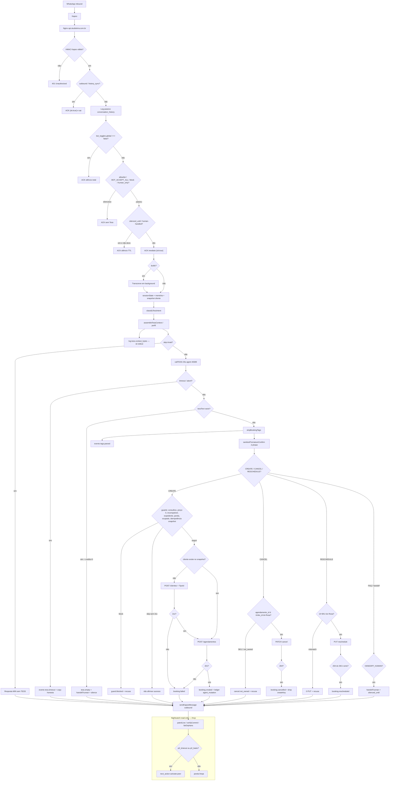

# Dossiê técnico/operacional — auditoria Tess 46589

**Para:** `@aiox-master` (Orion) + squads de auditoria (vertical técnica e fluxo/operação de negócio)  
**De:** Aria (@architect)  
**Quando:** 2026-09-03  
**Propósito:** dar à próxima sessão um mapa autocontido para procurar **padrões de falha** e propor **controles preventivos/preditivos**. Este arquivo substitui a leitura da conversa.

**Não é autorização de deploy.** Não é PRD. Não fecha DoD do epic. Recomendações da §8 são **PROPOSTA**.

---

## 1. Cabeçalho de estado

| Campo | Valor conhecido nesta sessão |
|---|---|
| Branch | `feature/tess-commit-honesty` (tracking `origin/feature/tess-commit-honesty`) |
| Último commit publicado (Story 13) | `07f59cb` — `fix: harden Nightwatch verification scope [Story 13]` |
| Estado **publicado** conhecido no VPS | `07f59cb` — Story 13 Nightwatch (timeout P0, verify client-scoped, metadata whitelist) |
| Alterações locais **ainda não publicadas** | Outras ondas fora da fatia 13 (resume-ia, AIOX/skills, admin, ops, KB, infra). **Particionar.** |
| Working tree | Centenas de alterações locais fora da fatia 13; não tratar o tree como um único release |
| Pronto para deploy? | **Story 13 publicada** em 2026-09-03 ~19:04 UTC. Demais workstreams continuam fora |

### Publicado (`0b39035`, Story 12) versus local (Story 13+)

```text
origin/VPS conhecido ── 0b39035 ── Story 12 no ar + smoke 0007/8440 PASS
HEAD local ─────────── 8efea3c ── docs do deploy 12
working tree ───────── Story 13 + dezenas de ondas não relacionadas
```

- **No ar:** honesty 1–12 (TipoId, sanitize C3, reschedule SKU, empty-handoff, createKeys, cancel-SKU, abort+booking, cancel-intent, CANCEL lean + timeout fallback).
- **Só no working tree:** monitoramento Nightwatch da Story 13. Sem push, sem rebuild VPS, sem alteração de allowlist nesta wave de monitoramento.
- **Fora desta fatia:** 300+ arquivos de AIOX, resume-ia, frontend admin, n8n/chatwoot pausados, skills, prompts archive. **Não empacotar juntos.**

[AUTO-DECISION] gotchas.json ausente → skip; SOT = handoff Orion + epic + gate 13 + código lido.

---

## 2. Executive summary

A Tess 46589 já **fala o que a Trinks gravou** nos smokes restritos de hoje (CREATE/CANCEL/cliente novo). O risco residual não é mais o bug B1–B4 isolado: é **observabilidade incompleta no live**, **contexto FULL grande em UNCERTAIN**, e um **working tree misturado** que pode publicar o pedaço errado.

### Gates desta sessão (Story 13 — local)

| Gate | Resultado | Onde |
|---|---|---|
| Testes focados Nightwatch + Trinks | **39/39 PASS** | `backend/test/nightwatch-ops.test.js`, `backend/test/trinks-api.test.js` |
| Suíte backend | **531/531 PASS** | `npm test --prefix backend` |
| Prompts / raiz | **79/79 PASS** | `npm test` |
| lint / typecheck / syntax / diff | **PASS** | `npm run lint`, `npm run typecheck`, `node --check`, diff de escopo negativo |
| CodeRabbit CLI | **0 findings** | revisão final do backend da Story 13 |
| Gate formal | **PASS** | `docs/qa/gates/tess-commit.13-nightwatch-monitoring-scope.yml` (`deployed_revision: N/A`) |

Story 12 (já publicada): 103/103 focados, 512/512 backend, 79/79 prompts, CodeRabbit 0, smoke `0007` PASS.

### Publicação VPS

**Pendente nesta sessão.** Story 13 **não** está no container. Health/smoke atuais validam `0b39035`, não o Nightwatch novo.

### Configuração live conhecida (após smokes 0007 / 8440)

| Controle | Valor conhecido | Verificar antes/depois de qualquer mudança |
|---|---|---|
| `BOT_ACCEPT_ALL` | `false` | Env do compose + `/health` (`mode=WHITELIST`) |
| Modo técnico | allowlist / `WHITELIST` | `bot_toggles.global=true` é só a chave técnica; **não** significa customer-wide |
| Allow | somente last4 **`0007`** | `bot_whitelist.mode='allow'`; fallback `BOT_ALLOWED_PHONES` também `0007`-only |
| `8440` | removido após smoke de cliente novo | Não deve reaparecer sem autorização explícita |
| Customer-wide | **bloqueado** | Não ligar `BOT_ACCEPT_ALL=true` |

**Exigir verificação before/after** de `BOT_ACCEPT_ALL`, `bot_toggles.global`, linhas `allow` (last4) e health interno/público. O cache de whitelist no backend é **5s** (`backend/lib/bot-state.js`).

---

## 3. Mapa da stack

Inbound WhatsApp chega na Kapso, o Express ACK imediato e processa em background, a Tess 46589 decide a fala/tags, o backend aplica guards e só então muta a Trinks. Snapshot local e ledger alimentam oferta e auditoria; Nightwatch lê Postgres sem mutar.

```text
WhatsApp ──► Kapso ──► Nginx ──► Express (CommonJS) ──► TESS agent 46589
                              │                         ▲
                              ├─ PostgreSQL (estado, ledger, eventos, snapshot)
                              ├─ Trinks API (SOT de agenda)
                              ├─ Snapshot local Trinks (oferta / guards)
                              └─ Nightwatch MCP read-only + Supervisor 46590
```

| Camada | Papel | Caminhos reais |
|---|---|---|
| WhatsApp / Kapso | Canal; webhook HMAC; outbound Cloud API | `POST /webhook/kapso` em `backend/server.js`; secrets em `infra/.env.example` (`KAPSO_*`) |
| Nginx | TLS + proxy `api.studiotirra.com.br`; `/mcp` timeout 120s, resto 35s | `infra/nginx/default.conf`. n8n/chatwoot **503** (CPU Hostinger; não religar nesta auditoria) |
| API Express / Node CommonJS | ACK, allowlist, intent, TESS, parser, guards, mutações, outbound | `backend/server.js` (`processMessage`, `callTESS` 25s, `createBookingInTrinks`) |
| Tess agent **46589** | Conversa + tags `[BOOKING_*]` / `[HANDOFF_]` | Prompt no dashboard (Victor cola). Diff no repo: `docs/prompts/`. Timeout: `backend/lib/tess-timeout.js` |
| Supervisor **46590** | Digest matinal, não o inbound | `backend/supervisor.js` |
| PostgreSQL (`influence_labs_salon`) | Histórico, toggles, whitelist, thread state, eventos, ledger, snapshots | `infra/schema.sql` + `infra/migrations/` |
| Snapshot local Trinks | Profissionais, serviços, slots, clientes, appointments | `infra/migrations/007_trinks_local_snapshots.sql`; `backend/lib/trinks-local-store.js` |
| Ledger de mutações | `trinks_api_requests` (método, origin, status, `metadata` JSONB) | mesma 007; wrapper `backend/lib/trinks-api.js` |
| Eventos operacionais | `bot_operational_events` append-only | `infra/migrations/010_bot_operational_events.sql` |
| Trinks API | SOT de commit (POST/PATCH/PUT 2xx) | `https://api.trinks.com/v1`; `trinks-mapping.js`, `trinks-client.js` |
| Sync worker | Reconcilia snapshot (container isolado) | `infra/docker-compose.yml` → `admin-trinks-sync` / `trinks-state-worker.js` |
| Docker Compose | `backend`, `postgres`, `nginx`, worker, admin; n8n/chatwoot no arquivo mas pausados no Nginx | `infra/docker-compose.yml` |
| Nightwatch | MCP read-only: `patrol_live`, `get_thread`, `verify_commit`, `list_orphans` | `backend/lib/nightwatch-mcp.js`, `backend/lib/nightwatch-ops.js`; URL pública `/mcp` |
| Manifests | Raiz = testes de prompt; backend = Express + `pg` | `package.json`, `backend/package.json` |
| Env (sem valores) | Allowlist, TESS, Trinks, Kapso, MCP | `infra/.env.example`. O `.env.example` da **raiz** é AIOS genérico — o operacional do bot é o da `infra/` |

### Tabelas / ledger que a auditoria precisa

| Tabela | Uso |
|---|---|
| `conversation_history` | Turnos; `trace_id` existe no schema e **quase não é preenchido** |
| `bot_toggles` | Kill switch `global` |
| `bot_whitelist` | `allow` / `block` / `human_only` |
| `bot_thread_state` | `silenced_until` (handoff / business_app) |
| `bot_operational_events` | `tags.parsed`, `booking.*`, `guard.blocked`, `tess.empty`, `tess.timeout`, `handoff.human` |
| `trinks_api_requests` | Ledger HTTP; metadata whitelist só em `agent_mutation_*` (Story 13, **local**) |
| `trinks_appointments` / `trinks_slots` / `trinks_clients` | Snapshot; **não** substitui a API no commit |
| `trinks_webhook_events` | SNS/webhook Trinks → markSlot (C2) |

---

## 4. Fluxograma inbound → outbound + observabilidade

Pontos de decisão em losango. ACK acontece **antes** de TESS/Trinks: silêncio após o ACK é falha de caminho assíncrono, não de webhook.



### Notas do fluxo (para a auditoria)

1. **Assinatura** — `validateKapsoSignature` antes de qualquer trabalho (`server.js` ~2536).
2. **Kill switch** — `global=false` ACK e sai; `BOT_ACCEPT_ALL=true` **não** fura o kill switch.
3. **Allowlist** — `block`/`human_only` vencem OPEN. Allowlist DB vazia cai no env.
4. **ACK** — `res.json({ ok: true })` **antes** de `processMessage`. Nginx lê o bot em 35s; TESS já aborta em 25s.
5. **Estado** — `sessionState` em memória (`createKeys`) + `bot_thread_state` + snapshot. Cancel **ops** não vê o Set.
6. **Intent** — `backend/lib/tess-context-intent.js`. B3: abort+pedido novo → `SCHEDULING`. B4: cancel com futuro → `CANCEL`.
7. **Contexto** — CANCEL high **não** carrega grade mesmo em `TESS_CONTEXT_MODE=full`. `UNCERTAIN`/`SCHEDULING` em full ainda podem ir a ~90k chars.
8. **Timeout** — `tess.timeout` + copy; **0** mutação; **não** `human-handled`. Publicado em `0b39035`. Sinal Nightwatch `p0_timeout` é **local** (Story 13).
9. **Parser** — tags nunca vão ao cliente; 2-phase só afirma depois do 2xx (`selectOutboundBlocks`).
10. **Guards** — snapshot/local **antes** da API. Idempotência CREATE consulta appointment **ativo**, não só `createKeys`.
11. **Trinks 2xx** — única fonte de sucesso. Ledger `origin=agent_mutation_*`.
12. **Outbound** — Kapso separado do ACK. Se TESS/catch falhar após ACK → silêncio aparente (mitigado para timeout; outros erros do `catch` de ~2763 ainda só logam).
13. **Nightwatch** — read-only; last4 na saída; correlação interna por telefone completo **só no código local** da Story 13.

---

## 5. Fluxos de negócio e invariantes

### Fonte de verdade

| Pergunta | Fonte | Não é fonte |
|---|---|---|
| O horário existe na agenda do salão? | **Trinks API** 2xx + appointment | Fala da Tess, tag, snapshot atrasado, Set `createKeys` |
| O que oferecer / o que bloquear? | Snapshot local (`trinks_slots`, `trinks_appointments`) + guards | Grade “lembrada” pela Tess |
| O cliente ouviu sucesso? | Outbound Kapso **depois** do 2xx (2-phase) | Texto da Tess antes do commit |
| O bot deve responder? | `bot_toggles` + `bot_whitelist` + `bot_thread_state` | `BOT_ACCEPT_ALL` sozinho |
| Houve timeout / órfão / leak? | `bot_operational_events` + ledger | last4 global sem escopo (bug da Story 13 no live atual) |

### Invariantes

| ID | Contrato | Quebra típica |
|---|---|---|
| **I1** | Afirmação de sucesso só com 2xx do **SKU/id certos** | “Confirmo aqui” / “já confirmamos” / PUT Barba quando o Rosa era Corte |
| **I2** | 1 SKU + slot + profissional → POST 2xx **ou** recusa honesta (inclui cliente novo e `tess.empty`) | TipoId 400 + turno seguinte mente; abort+pedido → FAQ/`dado_indisponivel` |
| **I3** | Relógio falado = início real da snapshot / duração contínua | Oferta de slot já ocupado (C2, mitigado); gravou 15:00 falou 15:30 |

“Tá certo?” é **pergunta**, não afirmação (não over-strip).

### CREATE / cliente novo

1. Intent `SCHEDULING`/`BOOKING` → contexto (FULL ou BOOKING).
2. Cliente confirma → tag CREATE (sem “Agendado!” na boca).
3. Guards. Idempotência: skip **só** se snapshot ativo tem o slot (`shouldSkipCreateIdempotent`).
4. Sem cliente: GET `/clientes` → `POST /clientes` com `Telefones[].TipoId=6` (`TELEFONE_TIPO_ID.WHATSAPP` em `trinks-mapping.js`) → `POST /agendamentos`.
5. 201 → `booking.created` + copy 2-phase com start+SKU do POST. Falha → `booking.failed` + copy honesta; turno seguinte **não** “já confirmamos” (C3 estendido).

Smoke `8440` (temporário, removido): GET 200 → POST cliente 201 → POST agenda 201. last4 `0101` **não** replay.

### CANCEL

1. Intent `CANCEL` high → perfil **CANCEL** (só reservas futuras; `horarios=0`).
2. `resolveCancelAgendamentoId`: só `trinks_id` do Rosa; SKU remapeia se **exatamente 1** futuro com aquele `service_id`; senão recusa (`sku_not_booking` / `sku_ambiguous` / `not_owned`).
3. PATCH 204 → `booking.cancelled` + `forgetCreateKeyForAppointment`. Timeout → copy “não cancelei”; 0 PATCH.

### RESCHEDULE

PUT só no `bookingId` + SKU do Rosa. Divergência (Barba no snapshot, Corte no texto) → 0 PUT + recusa. `booking.rescheduled` **só** no 2xx do SKU certo. Nightwatch local passa a contar isso como outcome de órfão.

### FAQ / handoff

FAQ / preço / abort puro **sem** pedido novo → sem grade. `HANDOFF_HUMAN` / `tess.empty` credits=0 → `handoff.human` + `silenced_until`. Abort + “agora só um corte…” → **SCHEDULING**, não FAQ (B3).

---

## 6. Matriz de incidentes / padrões (hoje)

Status: **local** = corrigido no working tree ou já commitado no branch; **live** = exercitado no VPS após `0b39035`. Story 13 = local **não** live.

| ID | Sintoma | Causa | Correção / status | Regressão / alerta |
|---|---|---|---|---|
| **B1** | CREATE no mesmo slot após cancel: 0 POST, “Confirmo aqui” | `state.createKeys` sobreviveu ao cancel ops; skip sem 2xx | Skip só com duplicata **ativa** no snapshot; drop key no cancel WhatsApp. Story 8 **no código + live smoke 0007 PASS** (`526224907` → 204 → `526226713`) | Unit CREATE→cancel→mesmo slot. Alerta: `create duplicado ignorado` **sem** `booking.created` + copy de sucesso |
| **B2** | Cancel usou SKU `14232906` → `cancel.not_owned` | Tag `agendamento_id` = serviço, não booking | `resolveCancelAgendamentoId`. Story 9 **código + live PASS** | Unit tag SKU + 1 futuro. Alerta: `cancel.not_owned` com `requestedId` ∈ catálogo |
| **B3** | “Esquece… agora só um corte” → FAQ + `dado_indisponivel` + silêncio 6h | `abort_draft` ganhou de booking na mesma frase | `hasAbortDismissSignal` + booking novo → `SCHEDULING`. Story 10 **código + live PASS** | Unit texto 09:48. Alerta: intent FAQ + `handoff.human` `dado_indisponivel` no mesmo turno de pedido de corte |
| **B4** | “Pode cancelar esse que a gente acabou de marcar” → FAQ | Intent FAQ quando `future_bookings=0` (efeito B1) + texto de cancel | Story 11: sinal de cancel → `CANCEL` mesmo sem futuro. **código + live PASS** (depende de 8+9) | Alerta: `hasCancelSignal` + intent FAQ |
| **Timeout CANCEL FULL** | Pedido de cancel correto; ACK ok; 0 tag, 0 PATCH, 0 outbound | `TESS_CONTEXT_MODE=full` carregou ~91k/22k tokens; `callTESS` 25s; catch só logava | Perfil CANCEL lean + `tess.timeout` + copy. Story 12 **`0b39035` + smoke PASS** (~6k chars, ~7,2s). **Não** houve timeout no smoke de validação | Alerta: `tess.timeout` (live já emite evento; patrol `p0_timeout` só após publicar 13). Não aumentar timeout Nginx como “fix” |
| **TipoId cliente novo** | POST `/clientes` 400 `'Tipo Id' must not be empty`; CREATE morre; turno seguinte “já confirmamos” | Payload sem `TipoId` | `TELEFONE_TIPO_ID.WHATSAPP=6`. Story 1 **código**. Smoke `8440` **PASS** (não replay `0101`) | Alerta: HTTP 400 TipoId no ledger `agent_mutation_create_client` |
| **`tess.timeout` ausente no patrol** | Timeout P0 invisível; peer não aciona | `patrolLive` olhava `tess.empty` em `p0_leaks`, não timeout | Story 13: `WATCH_EVENTS` + `signals.p0_timeout` + `activate-peer`. **Gate PASS, não publicado** | Após deploy 13: qualquer `tess.timeout` na janela deve aparecer em patrol. Hoje o live **não** tem esse sinal |
| **verify / listOrphans last4 global** | 2xx de outro cliente “prova” I1; órfão escondido por last4 colidido; reschedule virava órfão | `verifyCommit(last4)` lia mutações globais; órfãos por last4; `booking.rescheduled` fora de `OUTCOME_EVENTS` | Story 13: resolve 1 telefone na janela; `ambiguous_last4` fail-closed; órfãos por telefone completo; reschedule é outcome. **não publicado** | Alerta: `verdict=CONCERNS` `ambiguous_last4`. Testar dois last4 iguais em staging. Live atual **ainda** pode falso PASS |

Padrão transversal: **boca e commit em fontes diferentes** + **ACK cedo** + **contexto irrestrito** + **correlação por last4**. C1/C2/C3 (profsPayload, markSlot, sanitize `Confirmado,`) não reincidiram.

---

## 7. Controles implementados versus gaps

### Já no código **e** no live (`0b39035` e anteriores)

| Controle | Stories | Efeito |
|---|---|---|
| TipoId no POST `/clientes` | 1 | Cadastro novo não morre no 400 (provado em `8440`) |
| Sanitize C3 turno seguinte | 2 | Não “já confirmamos” pós-failed/blocked |
| PUT amarrado ao SKU Rosa | 3 | 0 PUT no serviço errado |
| `tess.empty` credits=0 → handoff | 4 | Silêncio + `bot_thread_state` |
| Pin SCHEDULING + 2-phase hora real | 6 | Menos UNCERTAIN pós-fail; copy cita POST 201 |
| I3 contíguo / recheck / fail-closed | 7 | Janela contínua; snapshot vazio não inventa slot |
| createKeys vs snapshot | 8 | B1 |
| Cancel só `trinks_id` | 9 | B2 |
| Abort + booking → SCHEDULING | 10 | B3 |
| Cancel recente → CANCEL | 11 | B4 |
| CANCEL lean + fallback timeout | 12 | Sem silêncio no timeout de cancel |

Prompt I.8/I.12: diff no repo (Story 5); **cola no dashboard = Victor**, fora do DoD de código.

### Story 13 — **corrigido no working tree, não publicado**

| Controle | Live hoje | Após publicar 13 |
|---|---|---|
| `tess.timeout` → `p0_timeout` | Evento existe (12); patrol **não** trata | Peer aciona |
| `verifyCommit` client-scoped + janela | last4/global — falso PASS possível | 1 telefone ou `ambiguous_last4` |
| `listOrphans` por telefone + reschedule | last4; PUT 204 podia órfão | Correlação correta |
| Metadata `agent_mutation_*` whitelist | Pode persistir mais que o combinado | Só `client_phone` + `kapso_conversation_id` opcional; erro sem PII |

### Residuais explícitos (não são “pronto”)

1. **`tess.context_bytes`** — só `console.log` em `backend/lib/tess-context-bytes.js`. **Fora** da Story 13. Sem evento em `bot_operational_events`, sem alerta Nightwatch. Follow-up de monitoramento.
2. **UNCERTAIN/FULL grande** — smoke `8440` confirmação ~89k chars / ~12,4s. P0 de CANCEL **não** cobre isso. Tratar como **sinal**, não como PASS de escala.
3. **Smoke pós-publicação da Story 13** — obrigatório e ainda não feito. Gate unitário ≠ live.
4. **Outbound sem outbox** — ACK já foi; se Kapso send falhar, não há retry durável.
5. **`conversation_history.trace_id`** — coluna existe (`infra/schema.sql`); inbound não amarra request/turn ponta a ponta.
6. **Catch genérico do webhook** (~2763) — não-timeout ainda pode virar silêncio sem evento.
7. **Working tree 321** — risco de publicar AIOX/resume-ia/admin junto com Nightwatch.

---

## 8. Recomendações aos squads — todas **PROPOSTA**

Não são requisitos aprovados. Não abrir story só porque estão aqui. Cada uma precisa de @pm/@po + spike se for entrar no backlog.

| ID | Proposta | Por que o padrão de hoje aponta para isso | Vertical |
|---|---|---|---|
| **P-TRACE** | Correlação `request_id` / `turn_id` do ACK Kapso até ledger, eventos, TESS `root_id` e outbound | Hoje o fio se reconstrói por last4 ±2 min | Técnica |
| **P-BUDGET** | Orçamento duro de contexto (chars/tokens) por intent; UNCERTAIN não herda FULL ilimitado; persistir `tess.context_bytes` como evento | 91k cancelou; 89k passou por sorte de latência | Técnica + negócio |
| **P-OUTBOX** | Watchdog/outbox: inbound ACK’d sem outbound em T segundos → copy honesta + evento, sem mutar Trinks | Timeout CANCEL foi silêncio de caminho, não de negócio | Técnica |
| **P-SLO** | Alertas SLO: taxa `tess.timeout`, `booking.failed`, `cancel.not_owned`, `handoff.human` `dado_indisponivel`, 400 TipoId, outbound Kapso ≠ 200 | Patrol é puxado; não há burn-rate | Ops |
| **P-SYNTH** | Synthetic allowlist (last4 de teste, slots que não são 03/09 10:30 André, sem `0101`): CREATE→cancel→re-CREATE, cancel SKU, abort+booking, cliente novo, CANCEL em full | Smoke humano não escala | QA + ops |
| **P-IDEM** | Idempotência durável (Postgres) alinhada ao snapshot ativo; não só Set de sessão | Cancel ops não vê memória | Técnica |
| **P-SNAP** | Contrato de frescura do snapshot vs API; webhook/markSlot e worker como SLO de consistência | I3 nasce de slot stale | Dados + negócio |
| **P-REL** | Release/rollback por **fatia** (hash de módulos + health + allowlist intacta); proibir “rsync do tree”; Hostinger fora do rito Tess | 321 arquivos; crash `MODULE_NOT_FOUND` no primeiro publish do dia | DevOps |
| **P-PRIV** | Privacy-by-design: last4 na saída; telefone completo só SQL interno; metadata whitelist; sem PII em erro de transporte; retenção do ledger | Story 13 já no código local; live ainda não | Segurança / LGPD |

Trade-off: orçamento de contexto vs. oferta rica (I3). Fail-closed de last4 vs. “verify sempre PASS”. Outbox vs. duplicar mensagem. **Squad escolhe; Architect não fecha.**

---

## 9. Runbook de auditoria e publicação

Sem Hostinger. Sem `rsync`. Sem colar prompt. Sem POST/PATCH Trinks no lugar do cliente. last4 only.

### 9.1 Pré-check de diff / escopo

```text
git status -sb
git log --oneline -8
git rev-parse HEAD                    # esperado: 8efea3c se o tree não commitou 13
git diff 0b39035 --stat -- backend/lib/nightwatch-ops.js backend/lib/trinks-api.js backend/server.js backend/test/nightwatch-ops.test.js backend/test/trinks-api.test.js
```

Aceitar na fatia 13 só o File List da story. Rejeitar se o stage trouxer `.agents/`, resume-ia, admin, AIOX, n8n, KB, prompts archive.

### 9.2 Gates (já corridos na Story 13; reexecutar se o diff mudar)

```text
node --test backend/test/nightwatch-ops.test.js backend/test/trinks-api.test.js
npm test --prefix backend
npm test
npm run lint
npm run typecheck
```

CodeRabbit no **diff da fatia**, não nos 321 arquivos. Gate: `docs/qa/gates/tess-commit.13-nightwatch-monitoring-scope.yml`.

### 9.3 Commit / push

Exclusivo **@devops**. Conventional commit + Story 13. Push `feature/tess-commit-honesty`. Architect/Dev **não** pusham.

### 9.4 Deploy VPS (rito já usado hoje — conceitual)

Worktree no host da API (padrão conhecido: `/opt/influence-labs/worktrees/tess-commit-honesty`). Copiar contexto Docker **atualizado**, `docker compose build --no-cache backend` + `up -d` **só** `backend`. Nginx: **reload**, não restart da stack. Sem `rsync`. Sem Hostinger MCP.

Primeiro publish do dia quebrou por `MODULE_NOT_FOUND` (`tess-context-slots`). Rollback foi checkout saudável + rebuild. Conferir SHA256 dos módulos da fatia no container vs. commit.

### 9.5 Health

| Check | Caminho |
|---|---|
| Interno | `GET` backend `:3001/health` |
| Público | `https://api.studiotirra.com.br/health` |
| Esperado | HTTP 200, `status=ok`, `trinks_ping=ok`, `tess.agent_id=46589` |
| Modo | `accept_all=false`, `mode=WHITELIST` |

Não logar tokens. last4 only.

### 9.6 Smoke pós-publicação

- Somente last4 **`0007`**. Outro slot. **Proibido:** 03/09 10:30 André, replay `0101`, `BOT_ACCEPT_ALL=true`.
- Exercitar o que a 13 muda: forçar/observar `tess.timeout` → patrol `p0_timeout`; `verify_commit` no last4 do fio (não em last4 alheio); órfão não some por outro telefone com o mesmo last4.
- Se precisar cliente novo: allow **temporário** + remoção (padrão `8440`).

### 9.7 Rollback

Rebuild do backend no commit anterior conhecido saudável (`0b39035` se só a 13 quebrar). Não mexer `.env`, volume Postgres, `bot_toggles`, `bot_whitelist`. Health 200 + allowlist `0007` intacta = rollback ok. Registrar em `docs/ops/nightwatch-log.md`.

### 9.8 Auditoria sem publicar

MCP: `patrol_live`, `get_thread`, `verify_commit`, `list_orphans` em `https://api.studiotirra.com.br/mcp` (Bearer; não colar token). Saber que **verify/orphans no live ainda são o código velho** até a 13 subir.

---

## 10. Handoff checklist — `@aiox-master`

### A sessão nova deve responder

1. O VPS ainda está em **`0b39035`**? Hash dos módulos 13 = working tree ou ainda 12?
2. Live ainda é **`BOT_ACCEPT_ALL=false` + allow só `0007`**? `8440` sumiu? `global=true` só técnico?
3. Publicar **somente** Story 13, ou a auditoria é só de padrões (sem deploy)?
4. Como particionar as **321** alterações? O que é honesty vs. resume-ia vs. AIOX vs. ruído?
5. Squads: um técnico (tracing, outbox, budget, SLO) e um de negócio (I1/I2/I3, synthetic, floor), ou um único wave?
6. Alguma **PROPOSTA** da §8 vira story, ou ficam no radar?
7. Quem cola prompt 46589 se I.8/I.12 ainda ensinarem afirmar na tag? (Victor; não o master.)
8. Critério para **sair** do piloto `0007` — não é “gates verdes”.

### Limites explícitos desta sessão / deste dossiê

- **Não** Hostinger, **não** `rsync`, **não** religar n8n/Chatwoot.
- **Não** `BOT_ACCEPT_ALL=true` / customer-wide.
- **Não** replay `0101`. **Não** slot 03/09 10:30 André.
- **Não** POST/PATCH Trinks no lugar do cliente.
- **Não** commit/push/deploy por Architect (este dossiê). Push = @devops com ACK.
- **Não** inventar `TipoId`. Valor vivo = `6` (contrato enumerado Trinks).
- **Não** tratar Story 13 como publicada. **Não** tratar 321 arquivos como release.
- **Não** promover §8 a requisito.
- **Não** PII completa; last4 only; sem tokens, sem `.env` real.
- Epic honesty: DoD de **unit**. Deploy **não** fecha o epic (`EPIC-tess-commit-honesty.md`).
- Supervisor 46590 e resume-ia Wave0 **fora** deste dossiê, salvo se contaminarem o diff da 13.

### SOT para colar na sessão

| Artefato | Path |
|---|---|
| Este dossiê | `docs/handoffs/2026-09-03-aiox-master-audit-dossier-tess.md` |
| Bugs + smokes do dia | `docs/handoffs/2026-09-03-orion-smoke-0007-bugs.md` |
| Log operacional | `docs/ops/nightwatch-log.md` |
| Epic | `docs/stories/epics/EPIC-tess-commit-honesty.md` |
| Story 13 | `docs/stories/salon-whatsapp-nightwatch-monitoring-scope.md` |
| Gate 13 | `docs/qa/gates/tess-commit.13-nightwatch-monitoring-scope.yml` |
| I1/I2/I3 Quinn | `docs/handoffs/2026-09-02-quinn-invariants-verdict.md` |
| RCA Aria | `docs/handoffs/2026-09-02-aria-rca-correcao.md` |

---

*[AUTO-DECISION] YOLO: elicitation pulada; dossiê escrito só com artefatos locais (reason: spawn mandou inspecionar disco e entregar um arquivo).*  
*[AUTO-DECISION] 321 = `git status --short \| wc -l` no momento da redação; recontar antes de particionar o release.*  
*[AUTO-DECISION] Propostas §8 não viram AC (reason: usuário pediu PROPOSTA, não backlog).*

— Aria, arquitetando o futuro
