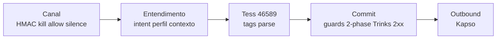

# Pedro Valerio — delta fluxo inbound→commit (T1+T2)

**Persona:** @pedro-valerio  
**Comandos:** `*eng-map` · `*eng-gaps` · `*veto-check`  
**Base:** blueprint 03/09 (`docs/analysis/2026-09-03-pedro-valerio-blueprint-tess.md`) + MEMORY T1/T2  
**Método:** delta — não refazer mapa de 23 etapas do zero  

---

## Processo: Atendimento WhatsApp inbound → commit Trinks

**Trigger:** mensagem WhatsApp com HMAC Kapso válido  
**Saída esperada:** resposta honesta ao cliente **e**, quando cabe, mutação Trinks 2xx antes de afirmar sucesso  
**Sistemas:** Kapso · Express `processMessage` · Tess 46589 · Postgres snapshot · Trinks API  

### Mapa resumido (23 etapas → 4 macro-fases)

| Fase | Etapas blueprint | Eixo | Dentes hoje? |
|---|---|---|---|
| Canal | 1–6 | Modo conversa | ✅ kill · denylist · silenced_until |
| Entendimento | 7–12 | Intent + perfil | ⚠️ regex local; perfil descartado pós-turno |
| Tess + tags | 13–16 | LLM + parse | ⚠️ timeout/empty OK; tags dependem do LLM |
| Commit + saída | 17–22 | Commit agenda | ✅ 2-phase + guards + ledger |
| Observabilidade | 23 | Funil/CRM | ❌ não existe |

---

## Delta T1+T2 vs blueprint (o que mudou na prática)

O blueprint de 03/09 **já previa** que o eixo 4 (commit) tinha dentes e que o risco estava no entorno. T1/T2 **confirmam** três regressões que copy patches não endereçam:

| ID | Gap medido (FDS) | Etapa blueprint | Tipo |
|---|---|---|---|
| **Δ-1** | Hold / “Confirmo” / F5 soam reserva **sem POST** | 17 sanitize + 21 2-phase | 🔴 Falha **entre** tag e commit — LLM fala; tag ausente, guard bloqueia, ou fluxo aborta antes de Trinks |
| **Δ-2** | Oferta verbal **não locka** slot (race 13h) | 18 guards CREATE | 🔴 **Ausência** de hold TTL no inventário — blueprint cita guards pós-intenção, não pré-fala |
| **Δ-3** | Recepção no fio **mata** 2-phase (F3×F5) | 5 silenced_until + 17 | 🔴 Conflito de eixos: humano silencia bot **e** cliente já ouviu promessa da Tess |
| **Δ-4** | Promessas **fora do eixo commit** (“recepção avisada”, “vou confirmar”) | 17 (só afirmação de agenda) | 🟡 Blueprint §3.2 já listava — T2 provou em produção |
| **Δ-5** | PIX/produto/combo no mesmo 46589 quebra CREATE | 13–18 | 🟡 H6 — escopo do mega-agente |
| **Δ-6** | `213h30` — raciocínio vazou | 13 callTESS | 🟡 H1 candidato, mas **secundário** a Δ-1/Δ-2 |

**Conclusão Pedro:** H3 (fluxograma) **parcialmente confirmada** — o 2-phase **não é** o bug principal; é o **último dente** num pipeline onde a boca já prometeu **antes** do eixo commit e **sem lock**. H4 (lock de inventário) **confirmada** como gap estrutural.

---

## *eng-gaps — Score e gaps críticos

**Score geral:** 6/10 → **ATENÇÃO** (mesmo score do blueprint; T1/T2 provam gaps 🔴 ainda abertos)

### 🔴 Gaps críticos (bloqueiam go-live)

1. **Checkpoint sem dentes: oferta de horário**
   - **Etapa:** entre 13 (Tess responde) e 18 (guards)
   - **Impacto:** cliente acredita ter horário; salão não tem row Trinks; race entre fios
   - **Correção (pesquisa):** hold TTL no snapshot **antes** de qualquer copy de disponibilidade definitiva; ou copy estritamente condicional (“se confirmarmos na agenda…”)

2. **Veto F3×F5 — humano no fio após promessa da IA**
   - **Etapa:** 5 + 17–21
   - **Impacto:** silêncio do bot ≠ transferência; cliente chega (Denise)
   - **Correção (pesquisa):** Syncra Martelo — humano **assina** commit ou **nega** com copy; silenciar bot não substitui estado de handoff

3. **Tag/commit desacoplados**
   - **Etapa:** 16–20
   - **Impacto:** Tess fala sucesso; `[BOOKING_CREATE]` ausente ou guard `blocked`; I1 deveria bloquear copy mas F5 contorna **semanticamente** (“confirmando” ≠ “confirmado”)
   - **Correção (pesquisa):** veto lexical F5 + exigir tag **ou** ramo FAQ sem verbo de commit; ampliar sanitize além de sucesso explícito

4. **Handoff sem dono (G-P5 do blueprint)**
   - **Impacto:** fio desaparece após `silenced_until`
   - **Correção:** registro de aceite + SLA (blueprint §4 P-HANDOFF)

### 🟡 Gaps médios

- Intent único + info-open frágil (H5) — mute FAQ
- `p0_stuck` contamina fios block/human_only (G-P7)
- Outbound pós-ACK sem outbox (G-P2)

### ✅ Pontos fortes (reusar)

- 2-phase + `selectOutboundBlocks` — **não afrouxar** (I1)
- Guards CREATE/CANCEL/RESCHEDULE determinísticos
- Kill switch + denylist precedência
- Classificador intent regex (0 LLM)
- Nightwatch read-only como observabilidade

---

## *veto-check — inbound→commit

| Checkpoint | Condição | Ação bloqueio | Owner | Veto com dentes? |
|---|---|---|---|---|
| HMAC | assinatura válida | 401 | Express | ✅ |
| Kill global | `global !== false` | ACK silêncio | admin | ✅ |
| Denylist | não block/human_only | ACK sem Tess | allowlist | ✅ |
| Human handled | silenced_until | bot calado | recepção | ✅ (mas conflita Δ-3) |
| Timeout Tess | ≤25s | 0 mutação | código | ✅ |
| 2-phase | afirmação ↔ 2xx | descarta bloco | código | ✅ |
| Guards CREATE | 7 guardas | blocked + recusa | código | ✅ |
| **Oferta horário** | slot reservado? | — | — | ❌ **AUSENTE** |
| **Promessa processo** | registro handoff? | — | — | ❌ **AUSENTE** |
| **F5 hold copy** | POST pending? | — | — | ❌ **AUSENTE** |

**Resumo veto:** 6/6 no eixo commit ✅ · 0/3 no entorno da boca ❌  
**Risco atual:** executar com copy F5 sem lock = repetir T2  
**Próximo passo (pesquisa):** desenhar ramo “proposta” vs “commit” **antes** do LLM falar

---

## Implicações Syncra (Human AI)

| Princípio Syncra | Estado FDS | Direção pesquisa |
|---|---|---|
| Se não está no sistema, não aconteceu | POST Trinks = verdade; fala ≠ row | Reforçar SOT no copy **e** no lock |
| Martelo: IA executa, humano assina | Recepção silencia bot, não assina | Handoff com aceite nomeado |
| Migalha de pão | Contexto 31k tok; perfil não persiste | Separar migalha booking vs FAQ |
| Worker vs Agente vs Humano | Guards = worker; 46589 = agente único | Squads **por executor**, não só por prompt |

---

*Pedro Valerio · delta vs blueprint 03/09 · evidência T1/T2 · 2026-09-08*
