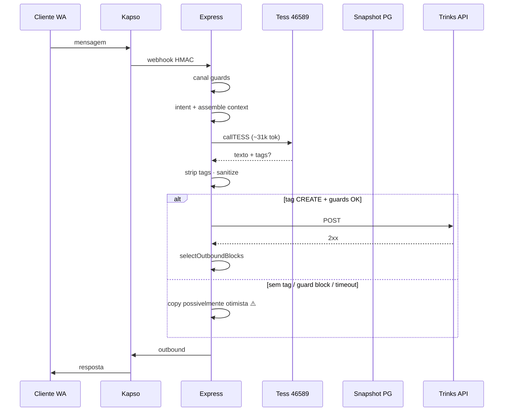
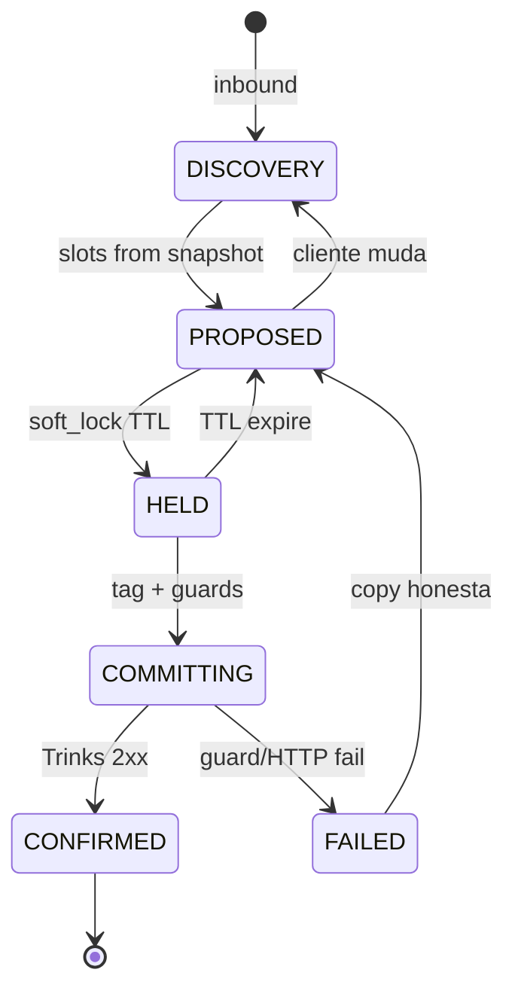
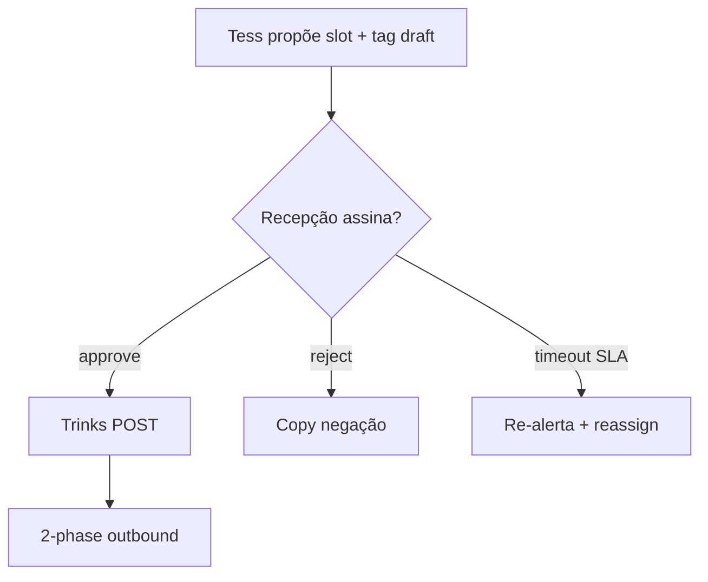

# Architect — fluxograma alvo vs o que está de pé

**Persona:** @architect (Aria)  
**Objetivo:** comparar arquitetura **atual** (mega-agente + código determinístico) com **alvo** de pesquisa — sem implementar  

---

## 1. O que está de pé (invariantes — BLOCK se afrouxar)

Fonte: blueprint §4 + MEMORY travas

| ID | Invariante | Mecanismo live | Veredicto |
|---|---|---|---|
| I1 | Afirmação de sucesso só com 2xx SKU/id certos | 2-phase · sanitize | **Manter** |
| I2 | Cancel/reschedule só em id owned | `resolveCancelAgendamentoId` | **Manter** |
| I3 | Fail-closed em timeout/empty | 0 mutação | **Manter** |
| — | Precedência kill > denylist > silence | `server.js:2643-2664` | **Manter** |
| — | Guards CREATE determinísticos | booking-guards | **Manter** |

**Insight arquitetural:** o “split real” **já aconteceu** — intent, guards, 2-phase são código; 46589 é **síntese de linguagem + tags**. A pergunta não é “quantos LLMs?” primeiro; é “onde ainda falta dente **antes** da fala?”.

---

## 2. Fluxograma AS-IS (simplificado)

**Falha T1/T2:** caixa ⚠️ — cliente recebe copy de compromisso quando ramo direito não executou POST.

---

## 3. Fluxograma TO-BE (opções de pesquisa — não escolhidas)

### Opção A — Reforço determinístico (menor blast radius)

Adicionar **estados explícitos** no hot-path **sem** novo agente:

| Elemento | Função | LLM? |
|---|---|---|
| PROPOSED | “Temos 13h **disponível**” — condicional | Tess redige, **template validado** |
| HELD | `hold:{prof}:{slot}` TTL 2–5 min | Worker 0 LLM (padrão HLD hotel) |
| COMMITTING | tags + guards + POST | Worker existente |
| CONFIRMED | 2-phase libera copy sucesso | Worker existente |

**Prós:** ataca H4 direto; preserva I1; sem multiplicar caminhos de veto  
**Contras:** exige schema hold + copy discipline; F3×F5 continua se não houver handoff Martelo  

---

### Opção B — Squad por executor (H10)

| Agente | Escopo | Modelo sugerido | Crédito |
|---|---|---|---|
| Router | intent FAQ vs BOOKING vs HANDOFF | barato / 0 LLM regex | ~0 |
| FAQ | preço, endereço, horário loja | perfil MIN | baixo |
| Booking | slots, tags, **sem** PIX/produto | perfil BOOKING enxuto | médio |
| Handoff | recepção, casos UNCERTAIN | copy curta + registro | baixo |

**Prós:** H6 — reduz prefixo BOOKING; isola PIX/combo  
**Contras:** blueprint alerta — **multiplica superfície I1**; cada agente precisa 2-phase ou **proibir** verbo de commit fora do booking agent  

**Arquitetura de veto obrigatória se B:** só **Booking Worker** pode emitir tags `[BOOKING_*]`; FAQ **hard-deny** lista de verbos de commit.

---

### Opção C — Digital Employee Cowork (H8) — back-office

46589 permanece no WhatsApp; **DE** no Mission Control:

| Papel DE | Trigger | Ação |
|---|---|---|
| Commit auditor | run pós-turno | comparar ledger vs copy enviada |
| Retry commit | guard transient fail | re-invoke com idempotência |
| Recepção assist | handoff event | fila Martelo com SLA |

**Prós:** API Tess DE tem invoke/runs/pause/rollback — ciclo de vida **≠** execute síncrono  
**Contras:** **não** substitui hot-path 25s; latência Cowork; integração a desenhar  

Fonte: `docs/guides/tess-api-reference.md` — Digital Employees ≠ agente 46589.

---

### Opção D — Human AI / Syncra Martelo (H9)

**Prós:** resolve F3×F5 — humano no fio **com** estado; Martelo explícito  
**Contras:** fricção operacional; salão precisa UI mínima (WhatsApp interno / painel)  

---

## 4. Matriz comparativa (arquitetura)

| Critério | AS-IS | A lock+estados | B squad | C DE Cowork | D Martelo |
|---|---|---|---|---|---|
| Fecha I1 (T2) | ❌ | ✅ se hold+copy | ⚠️ se veto rígido | ⚠️ async | ✅ |
| Race 13h | ❌ | ✅ hold TTL | ✅ se hold compartilhado | ❌ alone | ✅ |
| F3×F5 | ❌ | ⚠️ | ⚠️ | ⚠️ | ✅ |
| Crédito/mês | ~65–79k | ~similar | ↓ FAQ | +runs DE | +humano |
| Blast radius | — | baixo | médio | médio | operacional |
| Dependência produto novo | — | não | não | Tess Cowork | processo |

---

## 5. O que derrubar (architect)

| Hipótese | Veredicto | Motivo |
|---|---|---|
| “Trocar só o LLM” (H1 primeiro) | **Depriorizar** | Mesmo dano T1→T2 com copy diferente; piso ~18 cr permanece |
| “2-phase é o bug” (H3 total) | **Refutar** | 2-phase funcionou (Matheus 201); falha é **antes** e **semântica F5** |
| “Split FAQ/BOOKING no painel Tess” sem veto | **Bloquear** | Multiplica I1 (blueprint §6) |
| OpenClaw no hot-path WhatsApp | **Bloquear** | OpenClaw = Office layer; latência e ops erradas para 25s |
| Hermes **substituir** 46589 day-one | **Bloquear** | Runtime alternativo; pesquisa ≠ escolha |
| Lib Forge workers no commit | **Bloquear** | OP001–018 são 0 LLM consulta/simulação — não mutam Trinks |

---

## 6. O que reusar (architect)

- Pipeline Express existente (Stories 1–13)
- Classificador intent + assembler + guards + 2-phase
- Snapshot + `trinks-state-worker`
- Nightwatch MCP read-only
- Supervisor 46590 pattern (digest fora do inbound) — modelo para **auditor assíncrono**

---

*Architect · fluxograma alvo · pesquisa 2026-09-08 · sem implementação*
