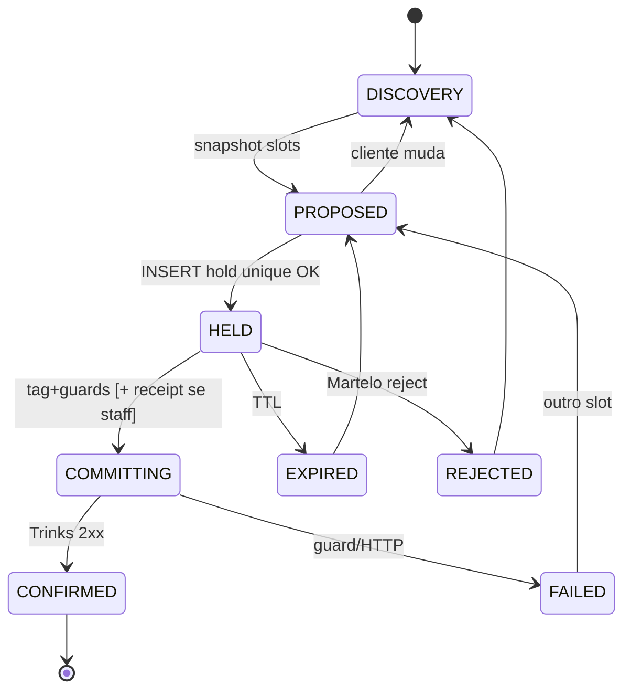

# 1.1 Architect — contrato de estados

**Persona:** Aria (@architect)  
**Veto:** afrouxar I1/I2/I3 / 2-phase / guards = BLOCK  

---

## Contrato

O hot-path ganha um **estado de inventário** ao lado do eixo 4 (commit). Tess 46589 continua sendo boca + tags. Worker é a única caneta do estado.

## Copy (contrato, não prompt)

- PROPOSED = disponibilidade **condicional**.
- HELD = TTL declarado; **não** é confirmação.
- COMMITTING = sem endereço.
- CONFIRMED = único estado com endereço / “te esperamos”.

`HOLD_COPY` atual viola o contrato (process-promise sem hold e sem 2xx). Remover, não parafrasear.

## Encaixe no AS-IS

Inserir **entre** parse de tags e outbound, **antes** de qualquer bloco que mencione horário como compromisso:

`assemble → callTESS → strip tags → [NEW hold/sanitize process] → guards → POST → selectOutboundBlocks`

Não criar segundo caminho de POST. Não multiplicar `selectOutboundBlocks`.

## Fora

Squad de agentes, DE Cowork, troca de modelo, OpenClaw, Hermes gateway.
